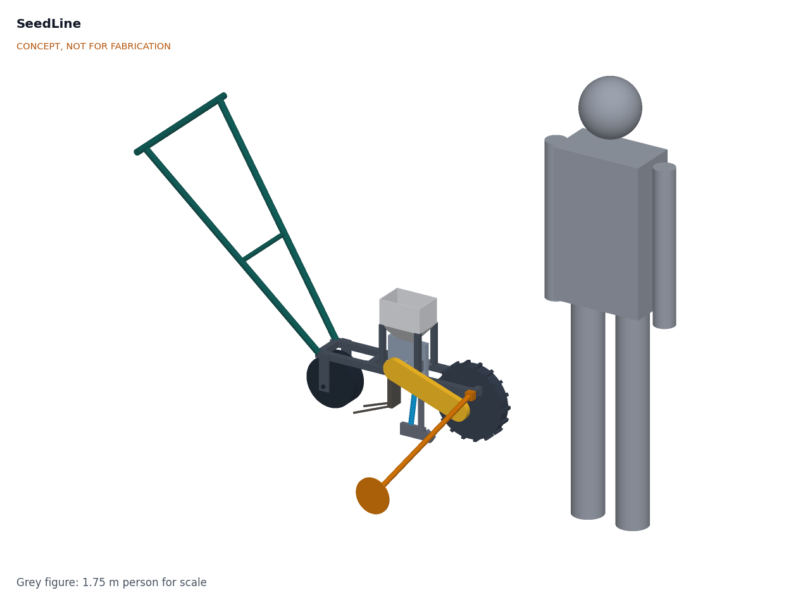

# SeedLine

  

**Area:** Agriculture · **TRL:** 3 of 9 (proof of concept on paper) · **Prototype budget:** about $400 USD · **Difficulty:** 2 of 5

Push seeder whose metering plates are 3D printed per crop and driven by the ground wheel, with an optional row-spacing kit.

[Interactive 3D model](media/viewer.html) · [Concept blueprint (PDF)](media/concept-blueprint.pdf) · [General arrangement SDL-DWG-001 (PDF)](cad/drawings/SDL-DWG-001.pdf) · [Calculations SDL-CAL-001](docs/04-calcs/01-sizing.md) · [Review note](docs/REVIEW.md)

## Concept rationale

Seed spacing on a push seeder should depend on distance travelled, not on how fast or unevenly the operator walks, so SeedLine drives its metering plate from a lugged ground wheel through a roller chain. The metering plate is the part that has to match each crop and seed size, and it is the part farmers usually cannot get: stock plates are sold by the maker for a few common crops. Making that one part a flat 3D print, sized by a parametric function from the seed's dimensions, turns crop coverage into a file rather than a spare-parts order.

Everything else is deliberately ordinary: square steel tube bolted with a drill and spanners, #35 roller chain and sprockets, trolley wheels and bearings found in regional towns. An open design lets a cooperative, an agro-dealer or a local workshop build, repair and adapt the seeder, and print plates for local varieties, without depending on an importer.

## Burning platform

Most of the world's farms are small: about 84 % of the more than 570 million farms worldwide are under 2 ha ([Lowder, Skoet and Raney, *World Development*, 2016](https://www.sciencedirect.com/science/article/pii/S0305750X15002703); [Our World in Data](https://ourworldindata.org/smallholder-food-production)), and in India the average operational holding fell to 1.08 ha in 2015 to 2016, with 68 % of holdings under 1 ha ([Agriculture Census 2015-16, Government of India](https://www.fao.org/fileadmin/templates/ess/ess_test_folder/World_Census_Agriculture/WCA_2020/WCA_2020_new_doc/IND_REP_ENG_2015_2016.pdf)). On such plots seed is still sown by hand, and hoe planting has been estimated at about 56 h per hectare for one worker in southern Africa (Baudron et al., cited in a [CSBE jab planter study](https://library.csbe-scgab.ca/docs/meetings/2010/CSBE101037.pdf)), squeezed into the short planting window after the first rains.

Uneven hand placement also costs yield. Purdue University trials on maize found a loss of about 2.2 to 2.5 bu/acre (about 140 to 160 kg/ha) for each inch (25 mm) increase in the standard deviation of plant-to-plant spacing ([Nielsen, Purdue University](https://www.agry.purdue.edu/ext/corn/research/psv/update2004.html)). Singulating push seeders that fix this cost about $499 before rollers, while low-cost plate seeders drop several seeds per cell ([University of Minnesota Extension](https://blog-fruit-vegetable-ipm.extension.umn.edu/2024/11/lower-cost-equipment-for-seeding-and.html)).

## Where it could be used

### By industry

| Industry | Use |
| --- | --- |
| Smallholder field-crop farming | Row planting of maize, beans, sorghum and groundnut at set spacing on 0.2 to 2 ha plots |
| Market gardening and urban farming | Vegetable beds sown with pelleted seed plates, cutting thinning labor |
| Agricultural extension and NGOs | Demonstration plots and conservation agriculture programs that promote row planting |
| Seed companies and agro-dealers | Printing plates matched to the varieties they sell; renting seeders to customers |
| Agricultural research and education | Spacing and population trials, and teaching metering design with printable plates |
| Community workshops and maker spaces | Local build, repair and plate printing as a service |

### By country or region

| Country or region | Why it matters there |
| --- | --- |
| Zambia and southern Africa | Conservation farming lays out hand-hoe planting basins in a precise grid of 15,850 per hectare and plants with the first rains ([Haggblade and Tembo, IFPRI, 2003](https://cgspace.cgiar.org/items/90eae4be-ba6d-448a-8d95-77e7a87ad25c)); hoe planting takes about 56 h per hectare for one worker ([CSBE jab planter study](https://library.csbe-scgab.ca/docs/meetings/2010/CSBE101037.pdf)) |
| India | Average holding of 1.08 ha, with 68 % of holdings under 1 ha ([Agriculture Census 2015-16](https://www.fao.org/fileadmin/templates/ess/ess_test_folder/World_Census_Agriculture/WCA_2020/WCA_2020_new_doc/IND_REP_ENG_2015_2016.pdf)), too small for tractor planters |
| Ethiopia and Tanzania | Small family farms average 0.8 ha in Ethiopia, where maize and sorghum are staples and only 3.7 % of smallholders have access to machinery ([FAO country factsheet, Ethiopia](https://www.fao.org/3/I8911EN/i8911en.pdf)); in Tanzania maize is the main staple and 1.4 % of smallholder households use motorized equipment ([FAO country factsheet, Tanzania](https://www.fao.org/3/I8356EN/i8356en.pdf)) |
| Guatemala | Small family farms make up 82 % of farms and average 0.6 ha, and mountains bound the cultivable area ([FAO country factsheet, Guatemala](https://www.fao.org/3/I8357EN/i8357en.pdf)); plots this small suit a push seeder rather than a tractor planter |
| United States and Canada | Market gardens that choose between a $187 plate seeder and a $499 roller seeder ([UMN Extension](https://blog-fruit-vegetable-ipm.extension.umn.edu/2024/11/lower-cost-equipment-for-seeding-and.html)); a printable plate fills the gap |

## What sparked the idea

The starting point was Jethro Tull's horse-drawn seed drill of about 1701, which replaced broadcast sowing with a rotating cylinder whose cut grooves carried seed from a hopper down to a funnel and into the furrow, where it was covered ([ASME](https://www.asme.org/topics-resources/content/jethro-tull)). The grooves were cut into the axle beneath the hoppers, so seed dropped at even intervals as the drill moved forward and sowed three regular rows; Tull described the machine in *Horse-Hoeing Husbandry*, first published in 1731 ([Science Museum Group, model of Tull's drill](https://collection.sciencemuseumgroup.org.uk/objects/co39077/1-4-scale-model-of-jethro-tulls-seed-drill); [Science Museum Group, Jethro Tull](https://collection.sciencemuseumgroup.org.uk/people/cp37700/jethro-tull)). SeedLine borrows that principle, seed carried in cells on a part turned by the machine's own travel, and changes who can make the metering part: the cells are cut into a flat plate that anyone with a desktop printer can produce for their own seed, three centuries after Tull cut his by hand.

## Problem

Hand-seeding is slow and uneven, and precision planters are too costly for small plots.

## Concept

A single-row push seeder for smallholder field crops first, with vegetable plates to follow. A 300 mm lugged ground wheel drives an upright, 3D-printed seed plate through a #35 roller chain, so seed spacing follows distance travelled rather than walking speed. A runner opener cuts the furrow, drag chains cover the seed and a press wheel firms it. Swapping the printed plate (1 to 36 cells, including skip-cell plates for long spacings) sets in-row spacing; the base seeder runs a 15 T wheel sprocket (26 to 471 mm), and an optional ratio kit with 12 and 18 T sprockets extends the range to 22 to 589 mm. Seed under 2 mm is sown pelleted. The operator walks at about 2.9 km/h so the plate cells fill. A marker arm sets the next row at 200 to 900 mm. The frame bolts together from 25 mm square tube, with a 22 mm tube handle.

TRL 3 calculations (SDL-CAL-001 v0.2, after the recommendations accepted in SDL-DDR-002): 0.142 ha/h for maize on 0.75 m rows, about 132 N push in the design case, 13.9 kg (14.9 kg with the marker kit) and $197.50 in parts for the base seeder ($237.50 with the marker and ratio kits). Mass and base cost now meet their targets with thin margins; placement quality and push effort on heavy seedbeds remain at risk.

Full design precis: [docs/02-concept.md](docs/02-concept.md)

## Key components

- 300 mm lugged ground drive wheel
- #35 chain drive with a 15 T wheel sprocket, a spring idler and a chain guard; 12 and 18 T sprockets in an optional ratio kit
- 2.4 L seed hopper and metering housing
- 3D-printed PETG seed plates, one per crop and spacing, with a singulator brush
- Runner furrow opener with depth bracket and covering chains
- 200 mm concave press wheel
- Bolted steel frame and telescoping 22 x 1.2 mm tube handle
- Row marker arm (optional row-spacing kit)

The priced bill of materials is in [bom/bom.csv](bom/bom.csv). The parametric model is [cad/src/model.py](cad/src/model.py), with STEP and STL exports in `cad/step/` and `cad/stl/`.

## Safety

> **Safety:** The chain drive turns whenever the wheel turns and has nip points; keep the guard fitted and hold the wheel still for plate changes and cleaning. The opener and wheel lugs are sharp. Seed treated with pesticides is toxic: follow the seed label, wear gloves and never reuse the hopper for food. See the safety section of [docs/02-concept.md](docs/02-concept.md).

## Repository layout

| Folder | Contents |
| --- | --- |
| `docs/` | Problem, concept, requirements, calculations and design decisions |
| `cad/src/` | build123d Python source, the source of truth for all geometry |
| `cad/step/`, `cad/stl/` | Exported models for FreeCAD, other CAD tools and printing |
| `cad/drawings/` | 2D sketches and dimensioned drawings |
| `bom/` | Bill of materials |
| `electronics/` | KiCad schematics and PCB layouts |
| `firmware/` | Microcontroller code |
| `media/` | Renders, perspectives and photos |
| `build-log/` | Dated prototyping notes |

## Documentation

Controlled documents follow the portfolio [documentation standard](.kit/STANDARDS.md). Each carries a document ID (SDL-PRC-001 for the precis), a version and a revision history. Branded PDFs are built with `python .kit/render.py` and attached to GitHub Releases when a document is tagged, for example `SDL-PRC-001/v1.0`.

## Credits

Designed by Amish Chadha. See [CONTRIBUTORS.md](CONTRIBUTORS.md) for roles. To cite this design, use [CITATION.cff](CITATION.cff) (GitHub shows it as "Cite this repository").

AI assistance (Claude) was used to accelerate concept renders, prototype documentation and first-pass sizing calculations. Design direction and all decisions are Amish Chadha's, recorded in this repository's decision records (`docs/decisions/`).

## Licenses

- **Hardware** (CAD, drawings, BOM, electronics): [CERN-OHL-S v2](LICENSE)
- **Software** (firmware, scripts, notebooks): [MIT](LICENSE-SOFTWARE)

A project of the [Design Molecule](https://designmolecule.com) lab.
