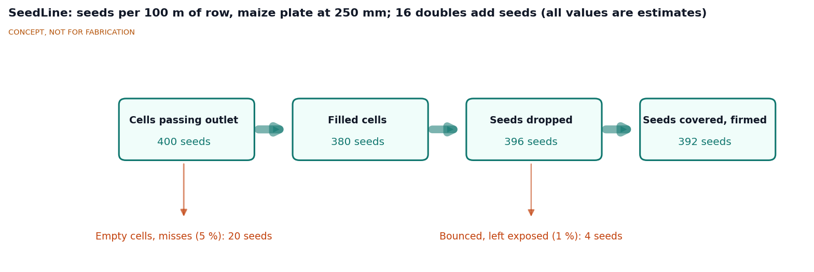
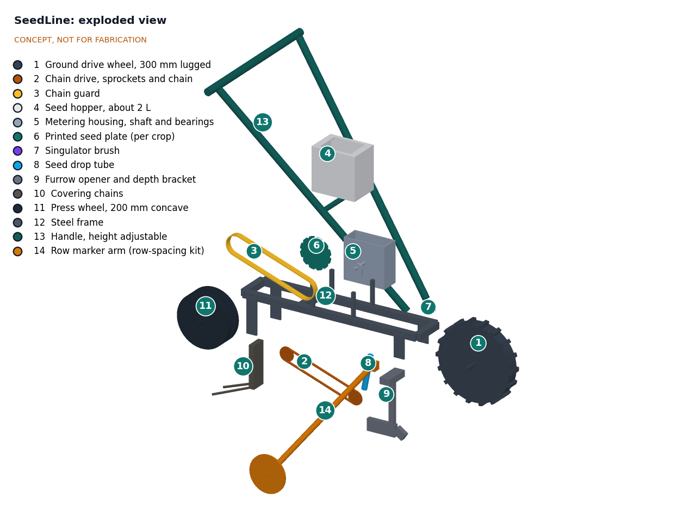
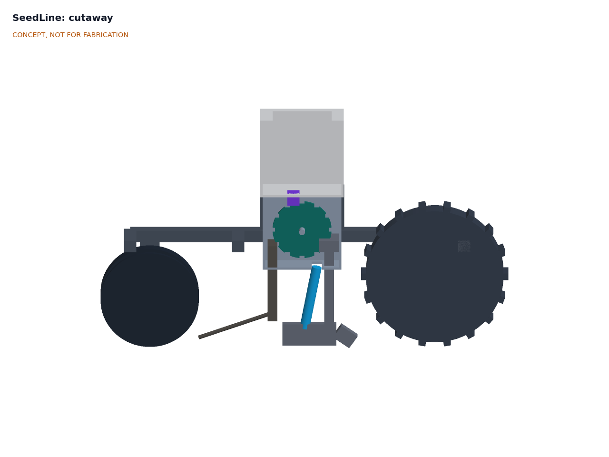

# SeedLine design precis

SeedLine is a single-row push seeder. A 300 mm lugged ground wheel drives a vertical, 3D-printed seed plate through a roller chain, so seeds are placed at a spacing set by distance travelled, not by walking speed. A runner opener cuts the furrow, chains cover the seed and a concave press wheel firms the row. Crop and spacing change by swapping a printed plate (3 to 36 cells) and, if needed, one sprocket. An optional telescoping marker arm scratches the line of the next row. First-order estimates give an in-row spacing range of about 20 to 390 mm, a work rate of about 0.14 ha/h for maize on 0.75 m rows (about 7 h/ha against about 56 h/ha by hoe), a mass of about 14 kg and a parts cost of about $223 with the marker kit, about $199 without.

*Figure 1. SeedLine with the row marker deployed at 0.75 m, and a 1.75 m person for scale. Direction of travel is toward the lower right.*

## How it works

1. **Load.** The operator pours up to about 2 L of seed into the hopper (item 4), which feeds the metering housing (item 5) below it.
2. **Drive.** As the seeder is pushed, the lugged ground wheel (item 1) turns. A 15-tooth #35 sprocket on its axle drives a 15-tooth sprocket on the plate shaft through a roller chain (item 2). Fitting a 12 T or 18 T sprocket on the wheel changes the plate speed by 0.8 or 1.2 times.
3. **Meter.** The printed seed plate (item 6) turns upright inside the housing. Cells on its rim pass through the seed pool at the bottom of the hopper, each picking up a seed. A brush (item 7) at the top of the plate sweeps off extra seeds, so each cell carries one.
4. **Drop.** As a cell passes the outlet on the forward side of the housing, its seed falls through the drop tube (item 8) into the furrow cut by the runner opener (item 9), just behind the opener's point.
5. **Cover and firm.** Two drag chains (item 10) pull soil over the seed and the concave press wheel (item 11) firms it, which improves seed-soil contact.
6. **Mark the next row.** The marker arm (item 14), clipped to the front cross member, drags a small disc at the set row spacing. On the return pass the operator follows that line with the ground wheel.

The frame (item 12) is two 25 mm square steel rails with cross members and axle drop plates; the handle (item 13) telescopes for operator height.

*Figure 2. Seed flow over 100 m of row for the maize plate at 250 mm spacing. All values are estimates; doubles add seeds, so more seeds are dropped than cells are filled.*

## Main components

Numbers match the exploded view (Figure 3) and `bom/bom.csv`.

| # | Component | Proposed choice | Notes |
| --- | --- | --- | --- |
| 1 | Ground drive wheel | 300 mm diameter, 45 mm wide, 18 lugs, on a 16 mm axle with bearings | Lugs limit slip; a narrow wheel runs in the tilled row |
| 2 | Chain drive | #35 roller chain, 15 T sprockets, with 12 T and 18 T alternates for the wheel and a spring idler | About 76 links; idler takes up the length change |
| 3 | Chain guard | Open-sided band around the chain loop, PETG or sheet steel | Covers the nip points from above and outside |
| 4 | Seed hopper | About 2.1 L, printed or cut from HDPE, lid | About 1.5 kg of maize, about 1,250 m of row per fill |
| 5 | Metering housing, shaft and bearings | Printed housing with seed outlet and side door; 12 mm shaft in two flange bearings | Side door and hand knob give tool-free plate changes |
| 6 | Printed seed plate | 120 mm diameter, 6 mm thick, 3 to 36 rim cells sized to the seed | About 25 g of PETG, about 1 h to print; one plate per crop and spacing |
| 7 | Singulator brush | Nylon strip brush on a printed holder, adjustable gap | Wear part |
| 8 | Seed drop tube | 20 mm tube, housing outlet to the opener | Short drop limits bounce |
| 9 | Furrow opener and depth bracket | Runner shoe on a steel shank, clamped in a slotted bracket (10 to 60 mm depth) | Depth set against the wheels |
| 10 | Covering chains | Two short lengths of light chain on a bracket | Low cost, self-cleaning |
| 11 | Press wheel | 200 mm diameter, 70 mm wide concave rubber tread | Firms the row; carries part of the load |
| 12 | Steel frame | 25 x 25 x 2 mm square tube rails, cross members, axle drop plates, hopper posts | Welded or bolted; see design choices |
| 13 | Handle | Two 25 mm tubes with a cross grip, telescoping for 850 to 1,050 mm grip height | Current model grip at about 950 mm |
| 14 | Row marker arm (row-spacing kit) | Telescoping arm and 140 mm marker disc, 200 to 900 mm reach, folds up for transport | Optional kit |

*Figure 3. Exploded view with numbered callouts matching the BOM.*

*Figure 4. Section on the row centerline, seen from the chain side with the chain side removed. The plate sits upright in the housing under the hopper, with the brush at the top and the outlet feeding the drop tube into the opener. The drive wheel is on the right, the press wheel on the left.*

## First-order numbers

All values are estimates for concept review and will be checked at TRL 3.

### Seed spacing

The plate turns i times per wheel turn, where i is the wheel sprocket teeth divided by the plate sprocket teeth (0.8, 1.0 or 1.2). With a plate of n cells and a wheel of effective diameter D, the nominal in-row spacing is

s = π D / (n i), with π D = 942 mm for D = 300 mm.

Wheel slip σ makes the real spacing longer by a factor 1 / (1 − σ). Slip of a lugged wheel on tilled soil is estimated at 3 to 8 %, so spacing may run 3 to 9 % long; the spacing tables will include a slip allowance.

#### Table 1. Example plates (nominal spacing, and with 5 % slip)

| Crop | Target spacing | Cells n | Ratio i | Nominal spacing | With 5 % slip |
| --- | --- | --- | --- | --- | --- |
| Maize | 250 mm | 4 | 1.0 | 236 mm | about 248 mm |
| Sorghum, groundnut | 150 mm | 6 | 1.0 | 157 mm | about 165 mm |
| Common bean | 100 mm | 9 | 1.0 | 105 mm | about 110 mm |
| Spinach | 50 mm | 16 | 1.2 | 49 mm | about 52 mm |
| Carrot (pelleted) | 25 mm | 30 | 1.2 | 26 mm | about 28 mm |
| Longest spacing | | 3 | 0.8 | 393 mm | about 413 mm |
| Shortest spacing | | 36 | 1.2 | 22 mm | about 23 mm |

The nominal range is about 22 to 393 mm, so R3 (25 to 400 mm) is not met at the long end without slip; see SDL-REQ-001.

### Metering speed

At 3 km/h (0.83 m/s) the wheel turns at about 53 rpm and the plate at 42 to 64 rpm. The cell circle (about 110 mm diameter) then moves at about 0.24 to 0.37 m/s. Cell fill falls off as cell speed rises; an assumed working limit of about 0.3 m/s (to be checked by bench test) means the 1.2 ratio plates should be used at about 2.5 km/h. The fastest plate (36 cells at 1.2) passes about 38 cells per second, which is demanding for the brush.

Plate and brush drag is estimated at 0.5 to 1.0 N·m, so the wheel needs a traction force of only about 4 to 8 N at its rim against about 60 N of load on it. The lugs should drive the plate without skidding; slip comes mainly from soil deformation.

### Work rate

| Quantity | Estimate | Basis | Requirement |
| --- | --- | --- | --- |
| Theoretical capacity, 0.75 m rows | 0.225 ha/h | 0.75 m x 3,000 m/h | |
| Field capacity, 0.75 m rows | **about 0.14 ha/h (about 7 h/ha)** | 65 % field efficiency for turns, refills and stops | R9 (0.1 ha/h) met |
| Hoe planting, for comparison | about 56 h/ha | Baudron et al., cited in the [CSBE jab planter study](https://library.csbe-scgab.ca/docs/meetings/2010/CSBE101037.pdf) | |
| Jab planter, for comparison | about 19 h/ha | About a third of hoe time (same source) | |
| Field capacity, 0.3 m vegetable rows | about 0.06 ha/h (about 17 h/ha) | 0.3 m x 3,000 m/h x 0.65 | |
| Maize seed per hectare, 0.75 x 0.25 m | about 53,000 seeds | 10,000 m² / 0.1875 m² | |
| Row per hopper fill, maize | about 1,250 m (about 0.09 ha) | 2.1 L x 0.72 kg/L at about 0.3 g per seed | R12 met |

### Placement quality

Estimated for a well-matched maize plate with a brush: about 5 % empty cells (misses) and about 4 % doubles (multiples), which gives the seed flow in Figure 2 and just meets R1. Spacing variation also comes from seed bounce in the drop tube and from slip changes over clods. With the Purdue figure of about 2.2 to 2.5 bu/acre lost per inch of spacing standard deviation ([Nielsen, Purdue University](https://www.agry.purdue.edu/ext/corn/research/psv/update2004.html)), each 25 mm of spacing variation avoided is worth about 140 to 160 kg/ha of maize at those yield levels; smallholder yields are lower, so the absolute gain will be smaller.

### Push force

Assumptions: seeder mass 14 kg; rolling resistance coefficient 0.2 to 0.3 on tilled soil for the two narrow wheels; opener draft 40 to 80 N at 50 mm depth; covering chains and press wheel 10 to 20 N; handle at about 50° to the ground, so a horizontal push F also pushes down with about 1.2 F.

| Case | Rolling | Opener | Chains, press | Horizontal push |
| --- | --- | --- | --- | --- |
| Good seedbed | about 27 N | 40 N | 10 N | **about 100 N** |
| Heavy or cloddy seedbed | about 41 N | 80 N | 20 N | **about 220 N** |

The downward share of the push adds rolling resistance, which raises the heavy case from about 140 N to about 220 N. R10 (150 N) is therefore at risk. A flatter handle, larger wheels or a shallower depth on heavy soil would help; these are TRL 3 checks.

### Mass and cost

| Group | Mass (estimate) | Cost (indicative) |
| --- | --- | --- |
| Wheels (items 1, 11) | about 4.0 kg | about $38 |
| Drive and metering (items 2 to 8) | about 2.3 kg | about $80 |
| Opener and covering (items 9, 10) | about 1.3 kg | about $19 |
| Frame and handle (items 12, 13) | about 5.2 kg | about $48 |
| Hardware (item 15) | about 0.3 kg | about $14 |
| **Base seeder** | **about 13.1 kg** | **about $199** |
| Row marker kit (item 14) | about 1.0 kg | about $24 |
| **With marker kit** | **about 14.1 kg** | **about $223** |

The base seeder costs about the same as an Earthway 1001-B with six plates (about $187) and well under a Jang JP-1 without rollers (about $499) ([UMN Extension](https://blog-fruit-vegetable-ipm.extension.umn.edu/2024/11/lower-cost-equipment-for-seeding-and.html)). The prototype is well inside the $400 budget.

## Key design choices

Every choice below is **Proposed, awaiting Amish**.

- **Metering type.** Option A: a vertical cell plate on a transverse shaft, driven directly by the chain (as modeled). Option B: a horizontal plate at the hopper base, as on many plate seeders, which needs a right-angle drive. Option C: a cell roller, as on the Jang, which is hard to print accurately in one piece. Recommendation: A, because the chain drives it directly and the plate is a flat print with no supports. Proposed, awaiting Amish.
- **First user group.** Option A: smallholder field crops (maize, beans, sorghum, groundnut on 0.75 m rows). Option B: market-garden vegetables in beds. Recommendation: A first, since hand planting labor and spacing losses are largest there, with vegetable plates as a second plate set. This affects the wheel, opener and small-seed work (R5). Proposed, awaiting Amish.
- **Meaning of the row-spacing kit.** Option A: a telescoping marker arm (as modeled). Option B: a gang bar that carries two or three metering units at a set spacing. Recommendation: A for this concept; record B as a later variant for vegetable beds. Proposed, awaiting Amish.
- **Ratio change.** Option A: plate cell count plus one wheel sprocket swap (12, 15, 18 T). Option B: plate cell count only, with a fixed 1:1 drive. Recommendation: A, since it triples the settings from one plate set at the cost of two sprockets and an idler. Proposed, awaiting Amish.
- **Wheel layout.** Drive wheel at the front, press wheel at the rear, as on most push seeders. The alternative is to drive from the press wheel, which rides on firmed soil and slips less but sits behind the covering chains. Recommendation: front drive wheel. Proposed, awaiting Amish.
- **Frame joining.** Option A: welded square tube. Option B: bolted tube with drilled holes and flat plates, buildable without a welder. Recommendation: B for the open design, with A as an option for workshops that weld. Proposed, awaiting Amish.
- **Plate material.** PETG as the default, ASA where plates sit in strong sun; PLA only for trials. Proposed, awaiting Amish.
- **Plate generator.** A parametric script that makes a plate from seed dimensions, cell count and shaft size would make "a plate for any crop" real. It is TRL 3 work and is listed as a suggestion in `docs/REVIEW.md`, not started. Proposed, awaiting Amish.
- **Partner and region for co-design.** Proposed, awaiting Amish.

## Safety

> **Safety:** SeedLine has an exposed roller chain driven by the wheel, a pointed steel opener and lugs, and is often used with chemically treated seed. Treat each as a hazard during use, cleaning, transport and plate changes.

- **Chain and sprocket nip points.** The chain moves whenever the wheel turns, including when the seeder is pushed or carried with the wheel spinning. Fingers, loose clothing and plant material can be drawn into the sprockets. The chain guard (item 3) must be fitted whenever the seeder is used, and plate changes and cleaning must be done with the wheel lifted clear and held still. Children should not push the seeder.
- **Sharp and pointed parts.** The opener point and the wheel lugs can cut shins and feet. Deburr all cut edges, round the lug tips and fit a cover over the opener for transport and storage.
- **Treated seed.** Seed dressed with fungicides or insecticides is toxic. Follow the seed label: wear gloves, do not eat, drink or smoke while filling, keep treated seed away from children and animals, and clean the hopper and housing outdoors. Never use the hopper for food or feed.
- **Row marker arm.** The deployed arm sticks out up to about 0.9 m to the side and can strike people or catch on posts at row ends. Fold it for turns near people and for transport.
- **Manual handling.** Lifting and turning at row ends and pushing on heavy soil can strain the back and shoulders (R10 and R11). Handle height must be set for the operator, and the seeder should be carried by two people or wheeled over rough ground.
- **Printed parts.** Plates, hopper and housing are plastic and can crack in cold or sun; a cracked plate can jam the drive. Inspect plates before each season and replace any that are cracked or worn.

## Open questions for TRL 3

- Confirm the metering type, first user group and meaning of the row-spacing kit (see above).
- Check cell fill against cell speed and seed shape, and the brush's effect on misses and doubles, by calculation and literature review.
- Decide how to cover 400 mm and wider spacings (R3) and whether small seed (R5) needs pelleted seed, a finer nozzle or resin plates.
- Refine the push force estimate (R10) with measured soil data from the partner region; consider a flatter handle and larger wheels.
- Estimate wheel slip on typical seedbeds and fold it into the spacing tables.
- Choose the chain tensioning method for the sprocket swap.
- Define the plate parameters for a plate generator (seed length, width, thickness; cell shape; clearance).
- Choose the co-design partner and the first crops and spacings to support.

Concept media: [blueprint sheet](../media/concept-blueprint.pdf), [interactive 3D model](../media/viewer.html).
