# SeedLine prototype build plan

**Plan, not yet built.** How to build the first proof-of-concept prototype, component by component. Building and testing to it is TRL 4 work. Decisions still to be made are kept in the design decisions register ([docs/06-design-decisions.md](06-design-decisions.md)), not here.

## 1. What you are building

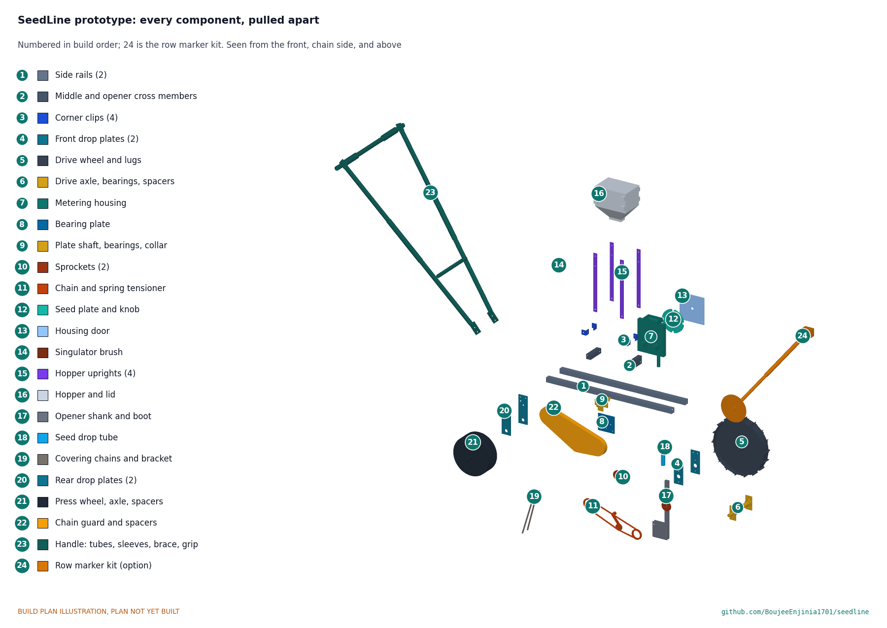

*Figure 1. Every component pulled apart and numbered in build order; 24, the row marker, is the optional row-spacing kit.*

The prototype is one SeedLine push seeder set up for maize: a steel frame of two square-tube rails on a 300 mm lugged drive wheel at the front and a 200 mm press wheel at the back, a printed metering housing and hopper in the middle, a roller chain from the drive wheel to the seed plate, a steel opener ahead of the housing, covering chains behind it and a telescoping handle. Figure 1 shows the 24 components in the order you make or fit them. Most are made in a small workshop: the rails, two cross members, four corner clips, four drop plates, the bearing plate, four hopper uprights, the wheel lugs, the drive axle and plate shaft, the opener shank and boot plates, the chain bracket, the handle tubes, brace and grip, and the marker parts; the housing, seed plate, knob, hopper and chain guard are 3D printed and the door is cut from clear sheet. The wheels, bearings, sprockets, chain, tensioner, brush, drop tube and fixings are bought. The work is sawing, drilling, tapping and filing steel tube, bar, angle and plate, flattening tube ends in a vice, bending strip, printing in PETG, and bolting it all together. Nothing is welded. The parts cost about USD 266 with both kits, from the bill of materials.

> **Safety:** SeedLine has a roller chain that moves whenever the wheel turns, a pointed steel opener and steel wheel lugs. Keep the chain guard on whenever the wheel can turn, lift the drive wheel clear and hold it still for plate changes and cleaning, and deburr every cut edge. Cut steel and flattened tube ends are sharp: wear gloves. Seed dressed with fungicide or insecticide is toxic: follow the seed label. Printing PETG gives off fumes; print in a ventilated space.

## 2. What changed to make it buildable

The concept showed what the seeder does; some of its parts ran through each other or had no fixing. Each change below keeps what the seeder does (the wheels, wheelbase, chain centres, plate, depth range, hopper size and handle position are unchanged), and all of them are recorded in decision record SDL-DDR-003, which Amish accepted on 2026-10-02.

*Table 1. Changes from the concept.*

| Component | The concept had | The buildable design has | Why |
| --- | --- | --- | --- |
| Front cross member | A cross member at the front that ran through the drive wheel | An opener cross member of 40 x 20 mm tube behind the wheel, 19 mm clear of the lugs (Figures 3 and 22) | It is the only place a cross member fits, and it carries the opener |
| Drive wheel and axle | A wheel on its own bearings, so it could not turn the sprocket; no bearings for the axle | Wheel fixed to the axle by a cross bolt; axle in two flange bearings inside the front drop plates (Figure 9) | The wheel now drives the chain |
| Opener | A shank and clamp running through the metering housing and seed plate | A shank bolted to the back of the opener cross member, ahead of the housing, with a two-plate boot (Figure 22) | Same depth range, width and leading-edge position |
| Metering housing and shaft | A housing floating on a shaft that ran between bearings on both rails, so the plate could not come off | A shaft held from the chain side only, in two bearings on a bearing plate; the housing hangs on the same bolts; a clear door and a knob for plate changes (Figures 12, 15 and 16) | Plate change by hand, and shaft and housing stay in line |
| Hopper | A throat wider than the housing, on four posts with no fixing | A neck that drops into a collar on the housing, held by four flat-bar uprights (Figures 19 and 20) | The hopper feeds the slot and is bolted down |
| Brush | A holder in the hopper throat's path | A brush through a slot in the housing's rear wall, gap set from outside (step 10) | |
| Chain guard and idler | A guard with no fixing and an idler arm with no pivot | A bought spring tensioner on a bolt through the rail; a guard shaped round its full travel, held by two spacers and screws; chain moved 12 mm outward (Figures 28 and 36) | Every nip point covered |
| Rear cross member | A cross member 4 mm above the press tyre | Removed; the clamped press axle ties the rails (Figure 26) | Clearance for the tyre and for mud |
| Handle | Tubes ending inside the rails; unjointed grip and brace | Flattened tube ends bolted to the rear drop plates and to the grip; sleeves for height (Figures 26, 29 and 32) | Bolted joints made with a vice and a drill |
| Corner joints | Flat plates across the tube ends | Four angle clips (Figure 4) | |
| Lugs, marker, drop tube | No fixings shown | Bolted L-lugs; a bent U-bracket for the marker; a drop tube that slides on a spigot so it follows the depth setting (Figures 7, 34 and 22) | |
| Mass | The added parts would have put the seeder over 15 kg | Drop plates 4 mm instead of 6 mm, lighter lid and marker parts | 14.9 kg with the marker kit |

## 3. Making the components

Make and check each component before the assembly step that needs it. Sizes are in millimetres. "Front" is the direction of travel; the "chain side" is the side with the chain, on the left when you stand behind the handle, and the "door side" is the other. Workshop tolerance is 0.5 mm unless a step says otherwise; drawings do not carry tolerances before TRL 4. Drill steel with cutting fluid and deburr every hole on both faces.

### 3.1 Side rails (make 2)

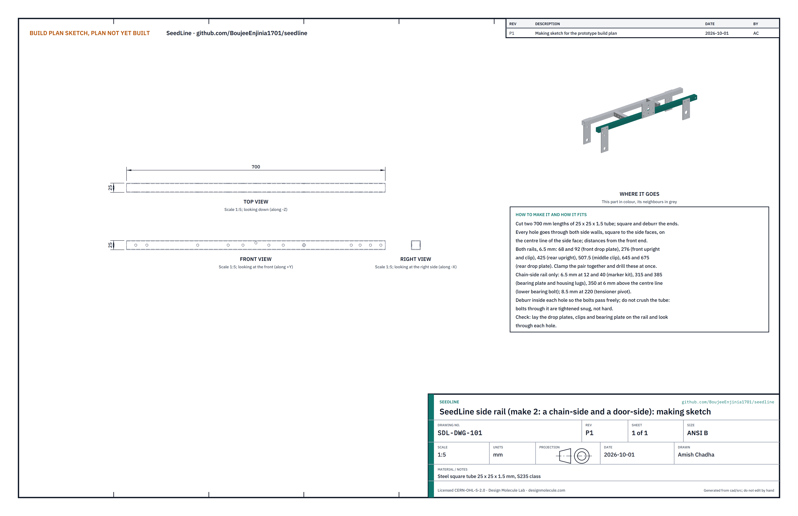

*Figure 2. Side rail making sketch (SDL-DWG-101).*

**What it is and what it is made from.** The two rails that everything hangs on. Steel square tube 25 x 25 x 1.5 mm, S235 class, two lengths of 700 mm.

**How to make it.**

1. Cut two 700 mm lengths; square and deburr the ends. Mark one end of each as the front.
2. Scribe a centre line along one side face of each rail. All holes go through both side walls, square to the side faces.
3. Clamp the two rails together and drill 6.5 mm through both at these distances from the front: 68 and 92 (front drop plate), 276 (front hopper upright and clip), 425 (rear hopper upright), 507.5 (middle clip), 645 and 675 (rear drop plate).
4. On the chain-side rail only: 6.5 mm at 12 and 40 (marker kit), at 315 and 385 (bearing plate and housing), and at 350 mm but 6 mm above the centre line (lower bearing bolt); 8.5 mm at 220 (tensioner pivot).
5. Deburr inside each hole so the bolts pass freely. Bolts through the tube are tightened snug, not hard, so the tube is not crushed.

**How it fits the parts next to it.** The cross members butt against the inside faces (Figure 4); the drop plates, bearing plate, uprights and marker mount bolt to the outside faces.

**Check before moving on.** Lay the drop plates, clips and bearing plate on the rail and look through each hole: they must line up without forcing a bolt.

### 3.2 Cross members (one middle, one opener)

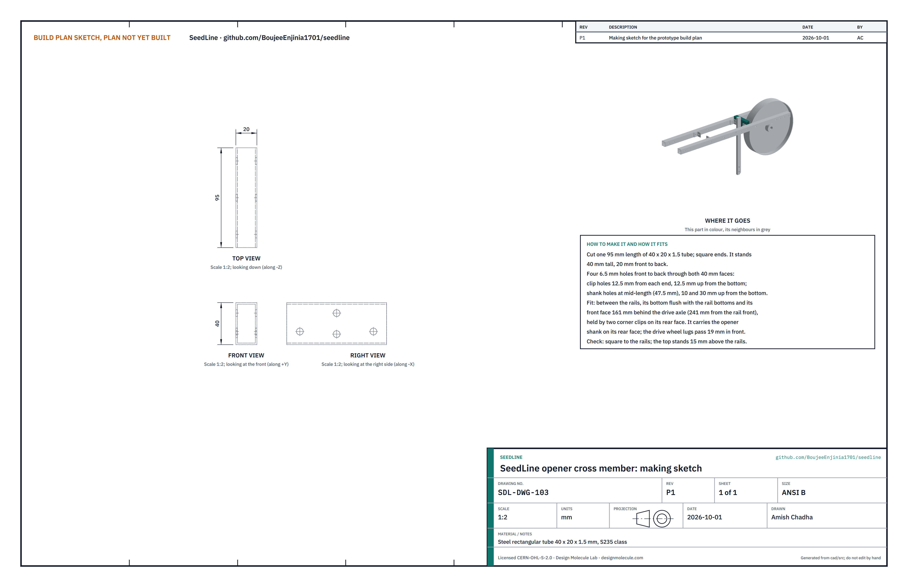

*Figure 3. Opener cross member making sketch (SDL-DWG-103); the middle cross member is SDL-DWG-102.*

**What they are and what they are made from.** Two short members that hold the rails 95 mm apart. The middle one is 25 x 25 x 1.5 mm square tube; the opener one is 40 x 20 x 1.5 mm rectangular tube standing 40 mm tall, and the opener shank bolts to its rear face.

**How to make them.**

1. Cut each to 95 mm with square ends: they butt against the inside faces of the rails, so a skewed end makes a skewed frame.
2. Middle cross member: four 6.5 mm holes front to back through both walls, on the centre line of the side face, at 12.5, 37.5, 57.5 and 82.5 from one end. The outer two take the clips, the inner two the chain bracket.
3. Opener cross member: four 6.5 mm holes front to back through both 40 mm faces: one 12.5 from each end and 12.5 up from the bottom (clips), and two at mid-length, 10 and 30 up from the bottom (shank).

**How they fit the parts next to them.** Both sit between the rails with their bottoms flush with the rail bottoms; the opener cross member's top stands 15 mm above the rails. The middle one is 400 mm behind the drive axle (480 from the rails' front ends) and the opener one has its front face 161 mm behind the axle (241 from the front ends). Each is held by two corner clips on its rear face.

**Check before moving on.** Each fits between the rails with no gap and no forcing.

### 3.3 Corner clips (make 4)

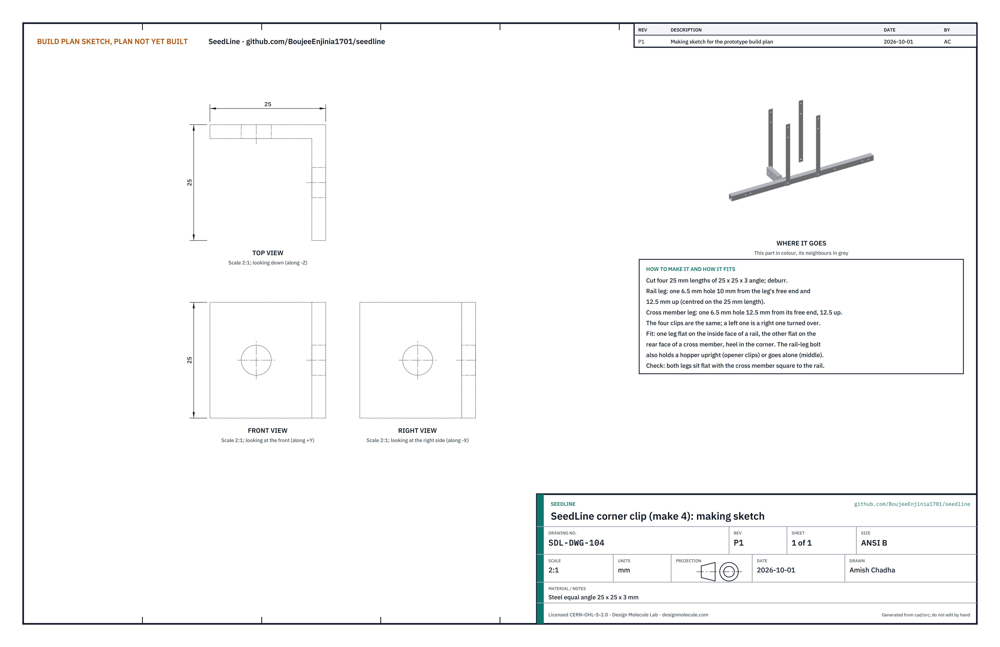

*Figure 4a. Corner clip making sketch (SDL-DWG-104).*

**What it is and what it is made from.** A short angle that joins a cross member to a rail. Steel equal angle 25 x 25 x 3 mm.

**How to make it.**

1. Cut four 25 mm lengths and deburr.
2. One leg (the rail leg): a 6.5 mm hole 10 from the leg's free end, centred on the 25 mm length.
3. The other leg (the cross member leg): a 6.5 mm hole 12.5 from its free end, centred.

**How it fits the parts next to it.**

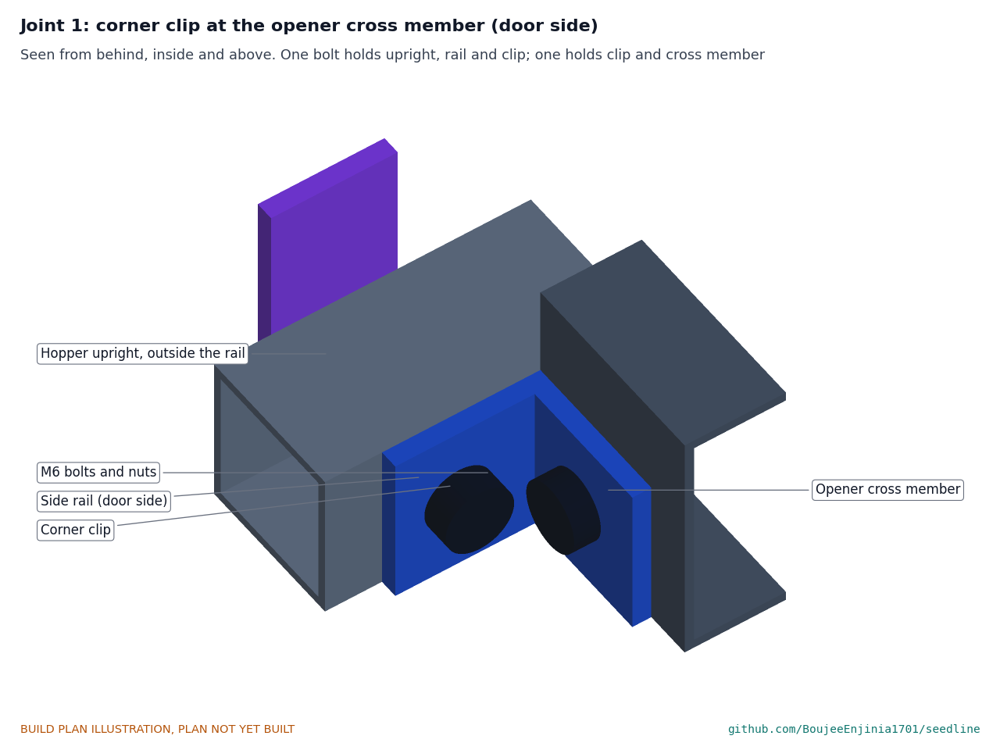

*Figure 4. One leg lies flat on the inside face of the rail and one on the rear face of the cross member, heel in the corner.*

The rail-leg bolt passes through the rail; at the opener cross member the same bolt also holds the front hopper upright on the outside of the rail. The cross-member-leg bolt passes through both walls of the cross member.

**Check before moving on.** Both legs sit flat and the clip holds the cross member square to the rail.

### 3.4 Front drop plates (make 2)

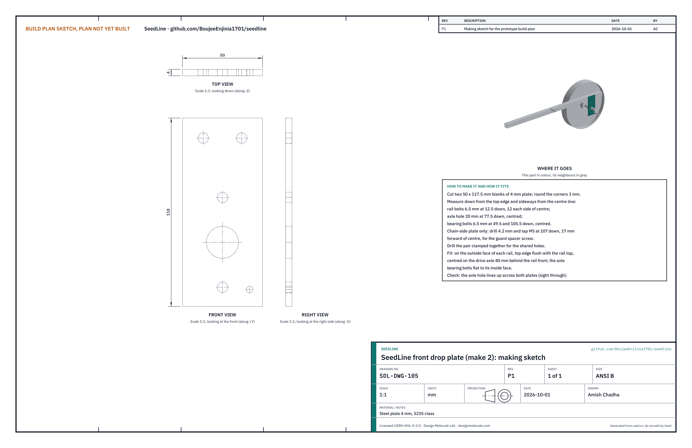

*Figure 5. Front drop plate making sketch (SDL-DWG-105).*

**What it is and what it is made from.** The plate on each rail that carries a drive axle bearing. Steel plate 4 mm, 50 x 117.5 mm.

**How to make it.**

1. Cut two blanks; round the corners to about 3 mm.
2. Measuring down from the top edge and sideways from the centre line: rail bolts 6.5 mm at 12.5 down, 12 each side; axle hole 20 mm at 77.5 down, centred; bearing bolts 6.5 mm at 49.5 and 105.5 down, centred. Measure your bearings first and move the bearing holes to suit them.
3. Drill the pair clamped together.
4. Chain-side plate only: drill 4.2 mm and tap M5 at 107 down and 17 forward of centre, for the chain guard screw.

**How it fits the parts next to it.** Each plate bolts to the outside face of a rail, top edge flush with the rail top, centred 80 mm behind the rail's front end. The axle bearing bolts to its inside face, below the rail (Figure 9).

**Check before moving on.** Bolted on, the two axle holes line up: sight through both.

### 3.5 Drive wheel and lugs

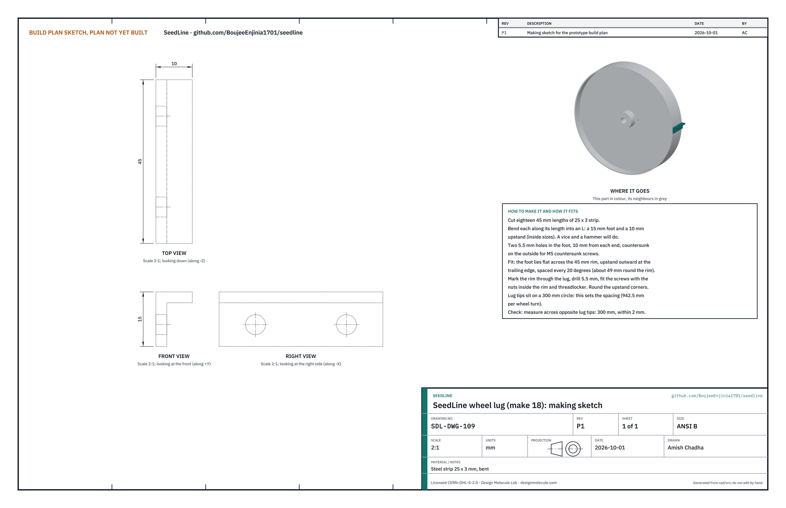

*Figure 6. Wheel lug making sketch (SDL-DWG-109).*

**What it is and what it is made from.** A bought steel disc wheel with a flat 45 mm rim and a plain 16 mm hub, no bearings, with 18 lugs that grip the soil. Each lug is bent from 25 x 3 mm steel strip.

**How to make it.**

1. Cut eighteen 45 mm lengths of strip and bend each along its length into an L: a 15 mm foot and a 10 mm upstand. A vice and a hammer will do.
2. Drill two 5.5 mm holes in each foot, 10 from each end, and countersink them on the outside.
3. Mark the rim every 20 degrees (about 49 mm apart round the rim). Hold each lug on its mark, foot across the rim, upstand at the trailing edge, and drill the rim through the lug.
4. Fit two M5 countersunk screws per lug with the nuts inside the rim and a drop of threadlocker. Round the upstand corners with a file.

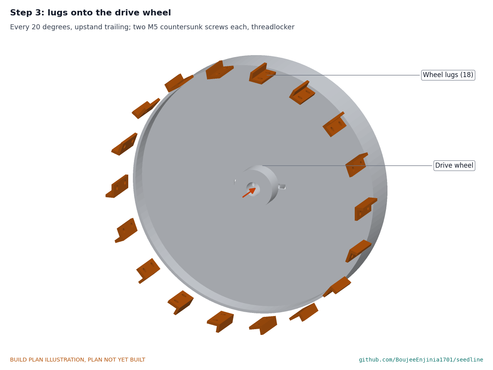

*Figure 7. The lugs go on every 20 degrees, all facing the same way.*

**How it fits the parts next to it.** The lug tips sit on a 300 mm circle: this circle sets the spacing, 942.5 mm of travel per wheel turn. The hub is fixed to the drive axle by an M6 cross bolt (section 3.6).

**Check before moving on.** Across opposite lug tips the wheel measures 300 mm, within 2 mm, every time.

### 3.6 Drive axle and spacers

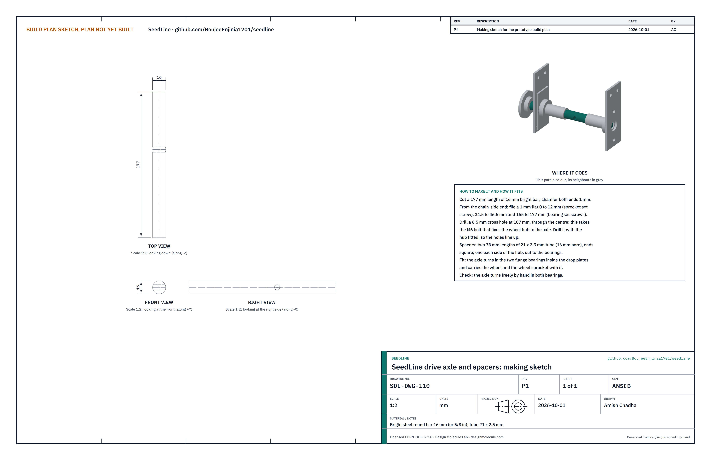

*Figure 8. Drive axle making sketch (SDL-DWG-110).*

**What it is and what it is made from.** The axle that turns with the wheel and drives the chain. Bright steel bar 16 mm (5/8 in suits), 177 mm long, with two spacers of 21 x 2.5 mm tube.

**How to make it.**

1. Cut 177 mm and chamfer both ends 1 mm. Mark the chain-side end.
2. File 1 mm flats for the set screws, measured from the chain-side end: 0 to 12 (sprocket), 34.5 to 46.5 and 165 to 177 (bearings).
3. Slide the wheel hub onto the axle with its centre 107 from the chain-side end and drill 6.5 mm through hub and axle together, square to the flats.
4. Cut two 38 mm spacers from 21 x 2.5 mm tube with square ends.

**How it fits the parts next to it.**

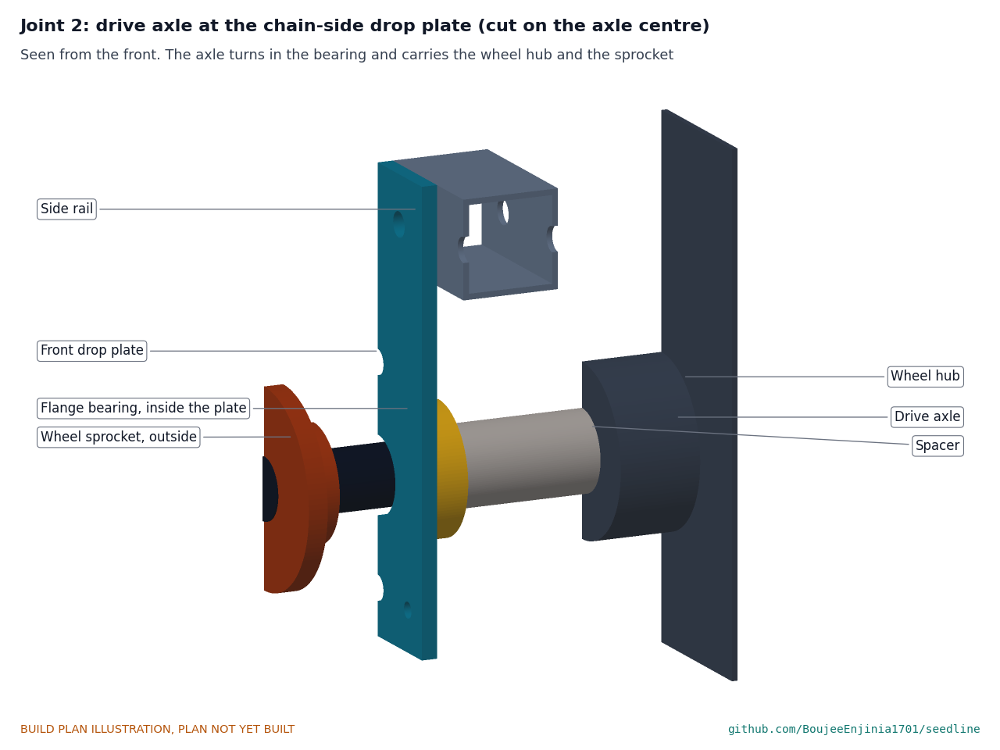

*Figure 9. The flange bearing bolts to the inside of the drop plate; a spacer runs from the bearing to the wheel hub; the sprocket sits on the axle outside the plate.*

The axle turns in the two flange bearings and carries the wheel and the wheel sprocket with it. The spacers locate the wheel in the middle; the bearing set screws hold the axle endwise.

**Check before moving on.** The axle turns freely by hand in both bearings, and the cross bolt passes through hub and axle without forcing.

### 3.7 Metering housing

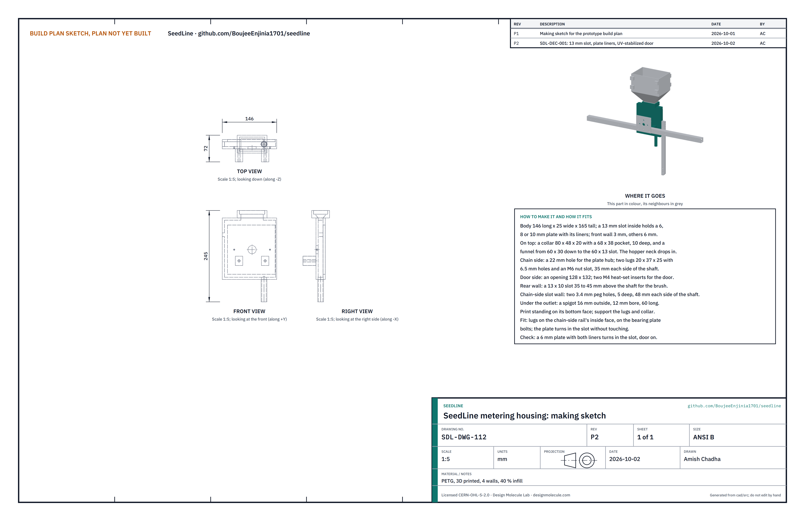

*Figure 10. Metering housing making sketch (SDL-DWG-112).*

**What it is and what it is made from.** The printed case the seed plate turns in. PETG, 4 walls, 40 % infill.

**How to make it.**

1. Print the body standing on its bottom face, with supports under the lugs and the collar. The body is 146 long, 25 wide and 165 tall, with a 13 mm slot inside. The slot takes a 6, 8 or 10 mm plate with a printed liner each side, so the plate has 1.5 mm to spare on each face; the front wall is 3 mm and the others 6 mm.
2. Check the features: on top, a collar 80 x 48 x 20 with a 68 x 38 pocket 10 deep and a funnel down to the slot; on the chain side, a 22 mm hole for the plate hub and two lugs 20 x 37 x 25 with 6.5 mm holes and M6 nut slots, 35 each side of the shaft; on the door side, an opening 128 x 132; in the rear wall, a 13 x 10 slot for the brush; in the chain-side slot wall, two 3.4 mm peg holes 5 deep, 48 mm each side of the shaft, for the liner; under the outlet, a spigot 16 mm across, 12 mm bore, 60 long.
3. Press two M4 heat-set inserts into the door-side wall for the door screws, at the door's screw positions (section 3.11).

**How it fits the parts next to it.** The lugs bolt to the inside face of the chain-side rail on the bearing plate's two bolts (Figure 12); the hopper neck drops into the collar (Figure 19); the drop tube slides onto the spigot; the brush passes through the rear slot.

**Check before moving on.** A 6 mm plate with both liners turns freely in the slot with the door on.

### 3.8 Bearing plate

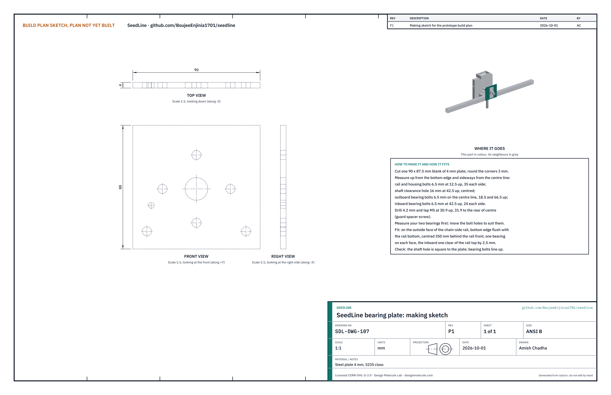

*Figure 11. Bearing plate making sketch (SDL-DWG-107).*

**What it is and what it is made from.** The plate that carries both plate-shaft bearings. Steel plate 4 mm, 90 x 87.5 mm.

**How to make it.**

1. Cut the blank and round the corners about 3 mm.
2. Measure your two bearings first. Then, measuring up from the bottom edge and sideways from the centre line: rail and housing bolts 6.5 mm at 12.5 up, 35 each side; shaft clearance hole 16 mm at 42.5 up, centred; outboard bearing bolts 6.5 mm on the centre line at 18.5 and 66.5 up; inboard bearing bolts 6.5 mm at 42.5 up, 24 each side.
3. Drill 4.2 mm and tap M5 at 30.9 up and 31.9 to the rear of centre, for the chain guard screw.

**How it fits the parts next to it.**

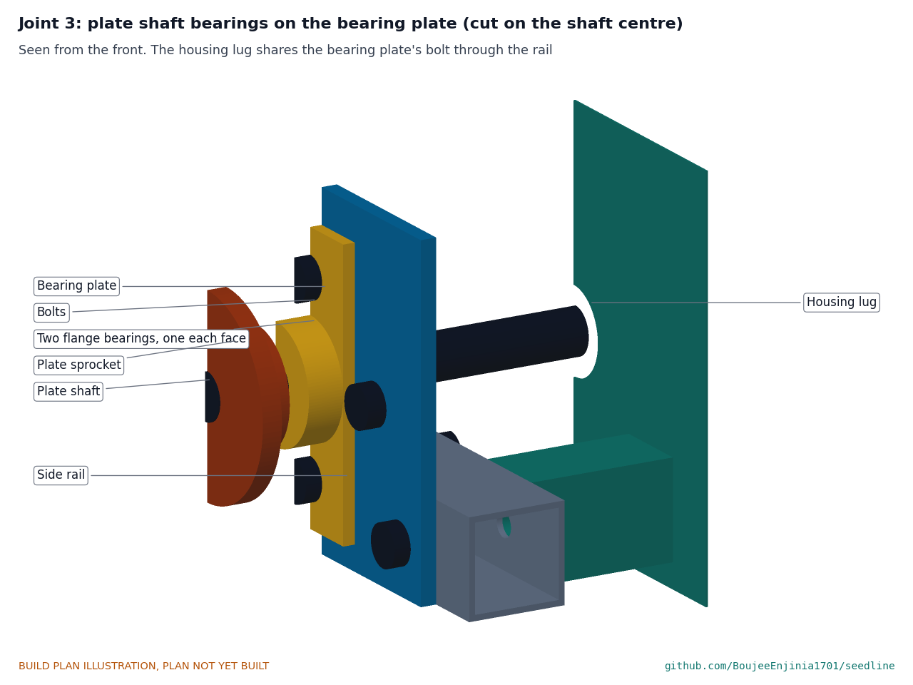

*Figure 12. One bearing on each face of the plate; the housing lug shares the plate's bolt through the rail.*

The plate bolts to the outside face of the chain-side rail, bottom edge flush with the rail bottom, centred 350 mm behind the rail's front end. The same two M6 bolts pass the plate, the rail and the housing lugs, with the nuts in the lugs' slots, so the shaft and the housing slot stay in line. The inboard bearing's flange clears the rail top by 2.5 mm.

**Check before moving on.** The shaft hole is square to the plate and both bearings bolt on without forcing.

### 3.9 Plate shaft

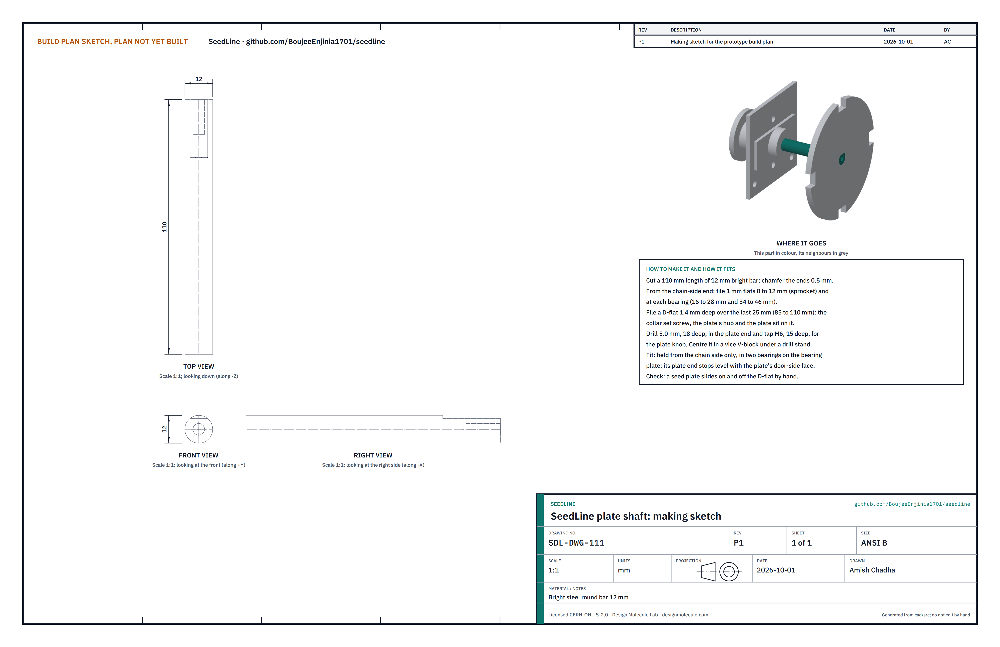

*Figure 13. Plate shaft making sketch (SDL-DWG-111).*

**What it is and what it is made from.** The shaft that turns the seed plate, held from the chain side only. Bright steel bar 12 mm, 110 mm long.

**How to make it.**

1. Cut 110 mm and chamfer the ends 0.5 mm. Mark the chain-side end.
2. File 1 mm flats, from the chain-side end, at 0 to 12 (sprocket) and at each bearing.
3. File a D-flat 1.4 mm deep over the last 25 mm at the other end; the collar, the plate's hub and the plate sit on it.
4. Hold the shaft upright in a V-block under a drill stand, drill 5.0 mm 18 deep in the plate end, and tap M6 15 deep for the knob.

**How it fits the parts next to it.** It runs in the two bearings on the bearing plate, passes through the housing wall inside the plate's hub, and stops level with the plate's door-side face. A 12 mm shaft collar on the D-flat, 12 mm short of the housing, sets where the plate sits.

**Check before moving on.** A seed plate slides on and off the D-flat by hand.

### 3.10 Seed plate

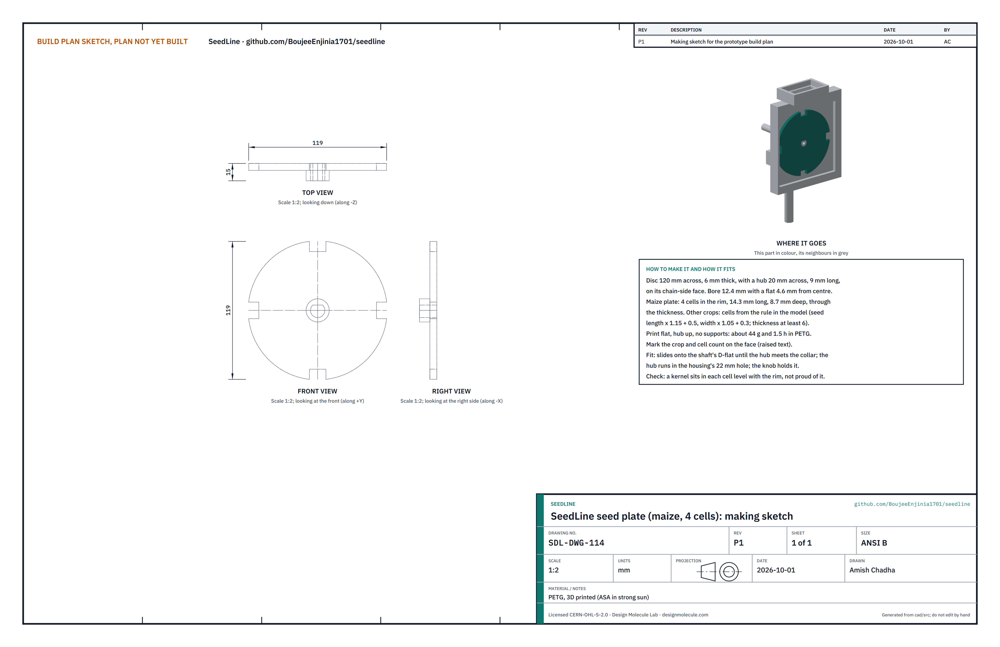

*Figure 14. Seed plate making sketch (SDL-DWG-114), the 4-cell maize plate.*

**What it is and what it is made from.** The printed plate whose rim cells each pick up one seed. PETG (ASA where plates sit in strong sun), about 44 g and 1.5 h to print.

**How to make it.**

1. Print flat, hub up, no supports: a disc 120 across and 6 thick, with a hub 20 across and 11 long on its chain-side face (the hub always ends 14 from the plate's centre plane, so a thicker plate has a shorter hub), a bore of 12.4 with a flat 4.6 from the centre, and four rim cells 14.3 long and 8.7 deep for maize.
2. Mark the crop and cell count on the face in raised text.
3. Other crops use the same plate with cells sized from the seed; the calculation note lists them.

**How it fits the parts next to it.**

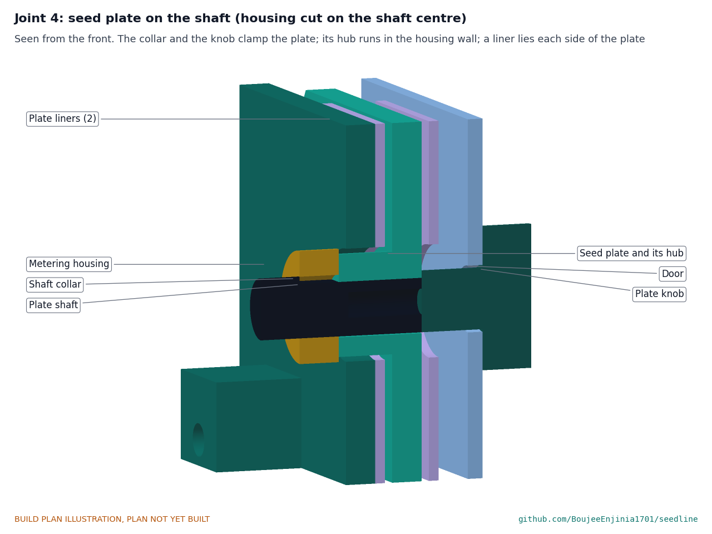

*Figure 15. The collar and the knob clamp the plate; its hub runs in the housing wall with 1 mm all round, and a printed liner lies each side of the plate, so seed cannot get out.*

**Check before moving on.** A maize kernel sits in each cell level with the rim, not standing proud of it.

### 3.11 Housing door, plate liners and plate knob

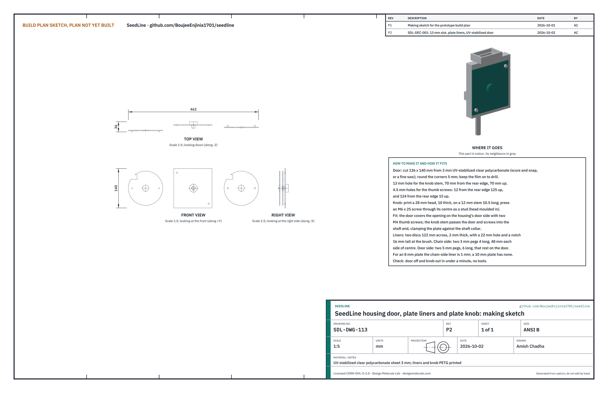

*Figure 16. Housing door, plate liners and plate knob making sketch (SDL-DWG-113).*

**What they are and what they are made from.** A clear door over the housing's side opening, so you can see the cells fill; two printed liners that narrow the 13 mm slot to the plate; and a printed knob that holds the plate on. Clear polycarbonate sheet 3 mm, UV-stabilized grade; the liners and knob in PETG, the knob with an M6 x 25 screw as its stud.

**How to make them.**

1. Cut the door 136 x 140 (score and snap, or a fine saw) with the film on; round the corners 5 mm.
2. Drill a 13 mm hole for the knob stem 70 from the rear edge and 70 up, and 4.5 mm holes for the thumb screws 12 from the rear edge at 125 up, and 124 from the rear edge at 15 up.
3. Print the knob: a 28 mm head, 10 thick, on a 12 mm stem 10.5 long, with a hexagon pocket that holds the screw head; press the screw in.
4. Print the two liners flat, each a disc 122 across with a 22 mm hole and a notch 16 tall where the brush enters. The chain-side liner is 2 mm thick for the 6 mm plate (1 mm for an 8 mm plate, none for a 10 mm plate) and has two 3 mm pegs 4 long, 48 each side of centre. The door-side liner is 2 mm thick with two 5 mm pegs 6 long (shorter for a thicker plate) that rest on the inside of the door.

**How they fit the parts next to them.** The door covers the opening on the door side with two M4 thumb screws into the inserts; the knob stem passes the door and screws into the shaft end, clamping the plate against the collar. The chain-side liner lies on the slot wall on its two pegs; the door-side liner hangs on the door's pegs, and the door holds it in place.

**Check before moving on.** Knob out and door off in under a minute with no tools; each liner sits 1.5 mm from the plate face.

### 3.12 Hopper uprights (make 4)

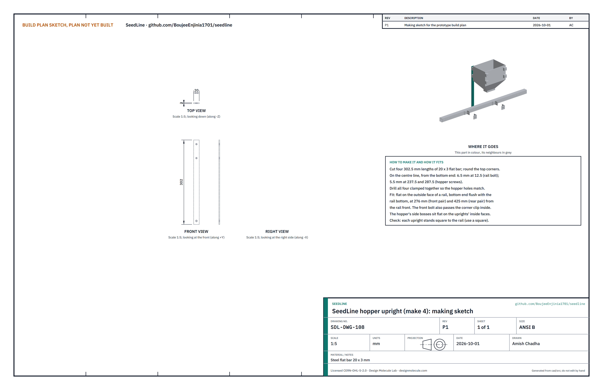

*Figure 17. Hopper upright making sketch (SDL-DWG-108).*

**What it is and what it is made from.** The four bars that carry the hopper. Steel flat bar 20 x 3 mm, 302.5 mm long.

**How to make it.**

1. Cut four lengths and round the top corners.
2. On the centre line, from the bottom end: 6.5 mm at 12.5 (rail bolt); 5.5 mm at 237.5 and 287.5 (hopper screws). Drill all four clamped together.

**How it fits the parts next to it.** Each lies flat on the outside face of a rail, bottom end flush with the rail bottom, at 276 (front pair) and 425 (rear pair) from the rails' front ends. The front bolts also pass the corner clips inside the rails (Figure 4). The hopper's bosses sit flat on their inside faces (Figure 20).

**Check before moving on.** Each upright stands square to the rail.

### 3.13 Seed hopper and lid

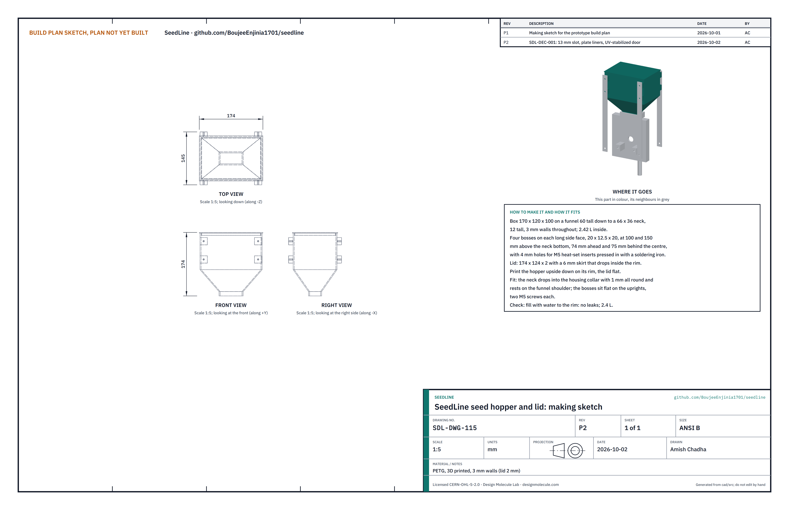

*Figure 18. Seed hopper and lid making sketch (SDL-DWG-115).*

**What it is and what it is made from.** A printed 2.4 L hopper with a lid. PETG, 3 mm walls (lid 2 mm), about 360 g.

**How to make it.**

1. Print the hopper upside down on its rim: a box 170 x 120 x 100 on a funnel 60 tall, down to a straight neck 66 x 36, 12 tall.
2. Check the four bosses on each long side (20 x 12.5 x 20, at 100 and 150 above the neck bottom, 74 ahead of and 75 behind the centre) and press an M5 heat-set insert into each 4 mm hole with a soldering iron.
3. Print the lid flat: 174 x 124 x 2 with a 6 mm skirt that drops inside the rim.

**How it fits the parts next to it.**

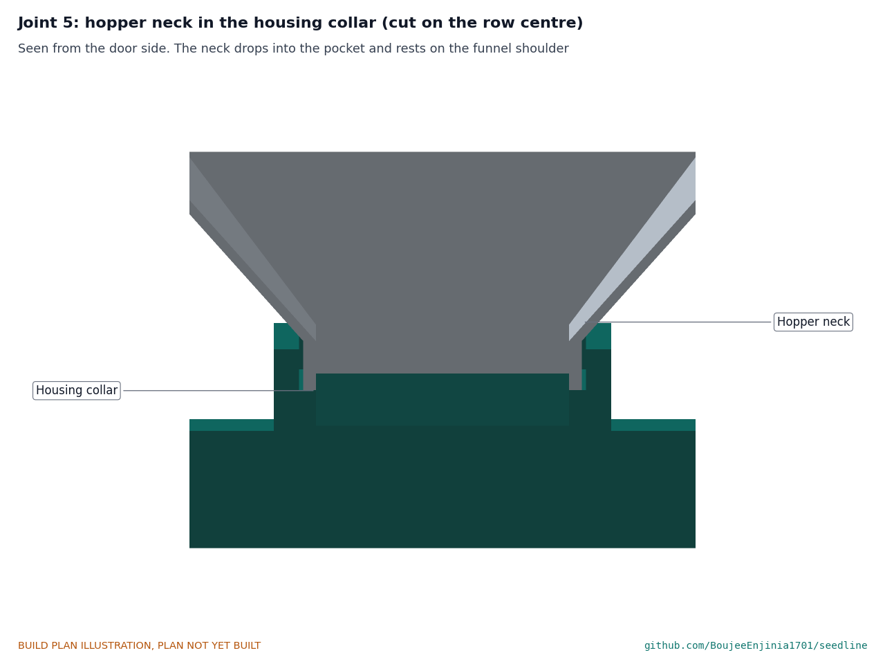

*Figure 19. The neck drops into the collar's pocket with 1 mm all round and rests on the funnel shoulder.*

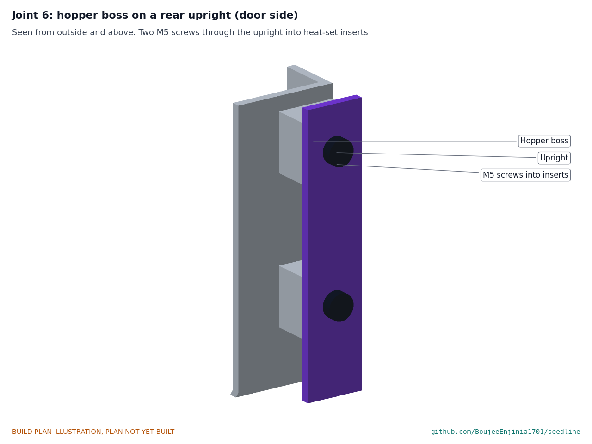

*Figure 20. Two M5 screws through each upright into the boss inserts.*

**Check before moving on.** Filled with water to the rim, the hopper holds about 2.4 L and does not leak.

### 3.14 Opener shank

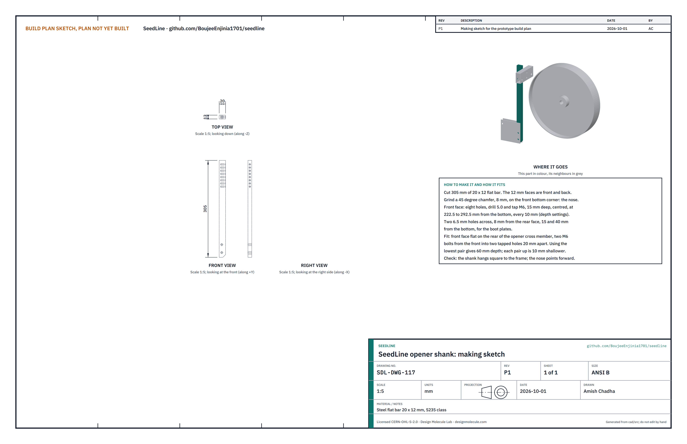

*Figure 21. Opener shank making sketch (SDL-DWG-117).*

**What it is and what it is made from.** The steel bar that cuts the furrow and sets the sowing depth. Steel flat bar 20 x 12 mm, 305 long; the 12 mm faces are front and back.

**How to make it.**

1. Cut 305 mm and grind a 45 degree chamfer, 8 mm, on the front bottom corner: the nose.
2. On the front face, drill 5.0 mm and tap M6, 15 deep, at eight heights from the bottom: 222.5, 232.5, and every 10 mm up to 292.5.
3. Drill two 6.5 mm holes across, 8 from the rear face, at 15 and 40 from the bottom, for the boot plates.

**How it fits the parts next to it.**

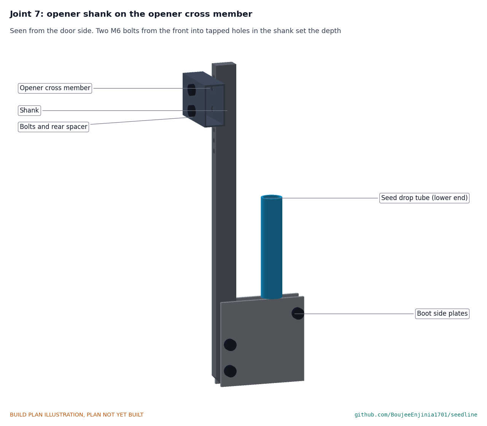

*Figure 22. The shank's front face sits on the back of the opener cross member; two M6 bolts from the front go into two tapped holes 20 mm apart.*

The lowest pair of tapped holes gives 60 mm depth; each pair up is 10 mm shallower, down to 10 mm. There is no nut behind the shank, because the housing is 3 mm behind it. The front of the shank is the opener's leading edge, 181 mm behind the drive axle.

**Check before moving on.** The shank hangs square to the frame with the nose forward, and both bolts go in by hand before tightening.

### 3.15 Boot side plates (make 2)

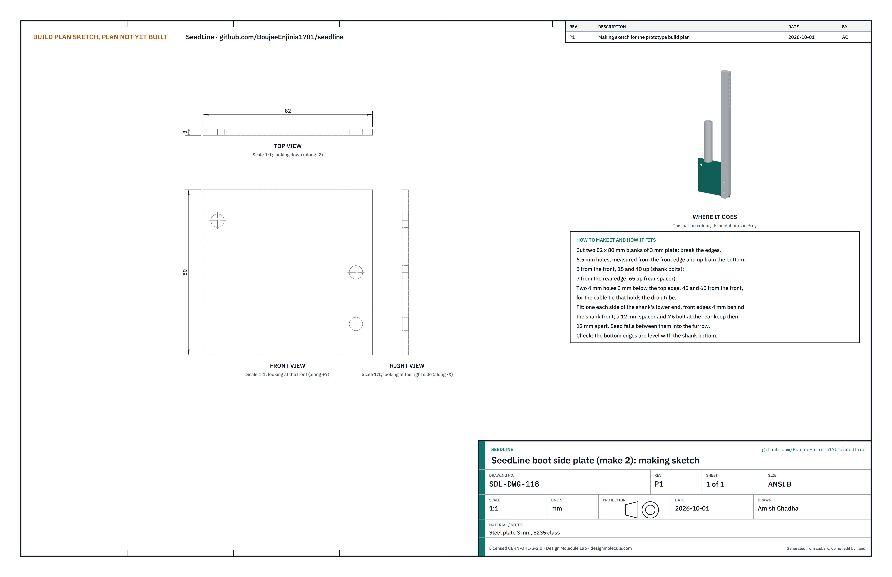

*Figure 23. Boot side plate making sketch (SDL-DWG-118).*

**What it is and what it is made from.** Two plates either side of the shank's lower end that hold the furrow open while the seed falls in. Steel plate 3 mm, 82 x 80.

**How to make it.**

1. Cut two blanks and break the edges.
2. 6.5 mm holes 8 from the front edge at 15 and 40 up (shank bolts), and 7 from the rear edge at 65 up (rear spacer).
3. Two 4 mm holes 3 below the top edge at 45 and 60 from the front, for the cable tie that holds the drop tube.

**How it fits the parts next to it.** One on each side of the shank, front edges 4 mm behind the shank front and bottoms level with it; a 12 mm spacer on an M6 bolt at the rear keeps them 12 mm apart, so the opener is 18 mm wide. The seed drop tube rests on their top edges (Figure 22).

**Check before moving on.** The bottom edges are level with the shank bottom and the gap between the plates is 12 mm all the way down.

### 3.16 Covering chain bracket

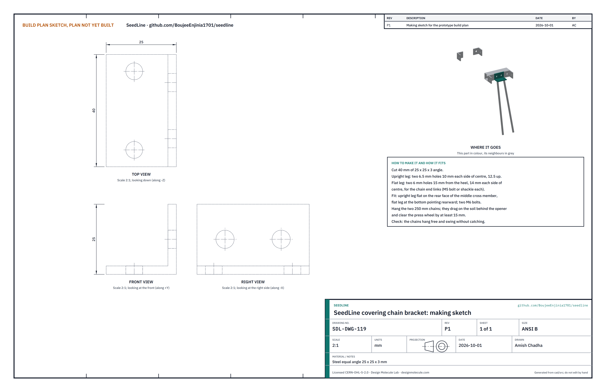

*Figure 24. Covering chain bracket making sketch (SDL-DWG-119).*

**What it is and what it is made from.** A short angle that hangs the two covering chains. Steel equal angle 25 x 25 x 3 mm, 40 long.

**How to make it.**

1. Cut 40 mm.
2. Upright leg: two 6.5 mm holes 10 each side of centre, 12.5 up.
3. Flat leg: two 6 mm holes 15 from the heel, 14 each side of centre, for the chain end links.

**How it fits the parts next to it.** The upright leg bolts flat to the rear face of the middle cross member with two M6 bolts, the flat leg at the bottom pointing rearward. The two 250 mm chains hang from it on M5 bolts and drag over the furrow behind the opener, at least 15 mm clear of the press wheel.

**Check before moving on.** The chains hang free and swing without catching.

### 3.17 Rear drop plates (make 2)

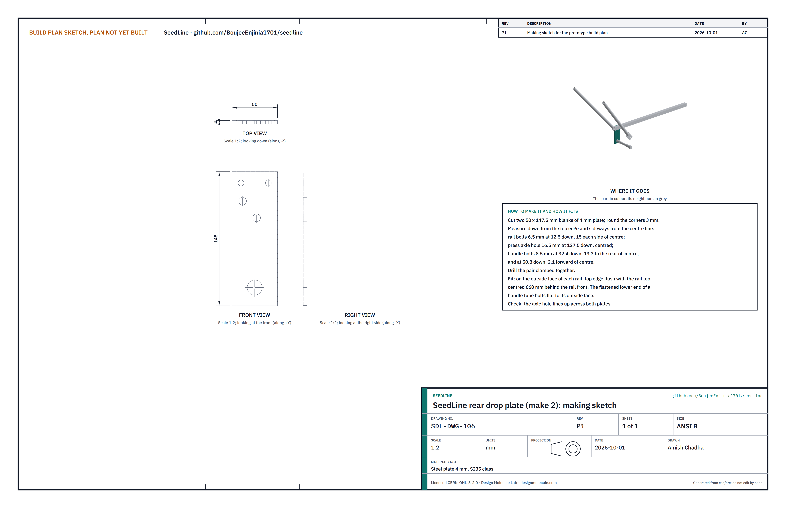

*Figure 25. Rear drop plate making sketch (SDL-DWG-106).*

**What it is and what it is made from.** The plate on each rail that carries the press axle and the bottom of a handle tube. Steel plate 4 mm, 50 x 147.5 mm.

**How to make it.**

1. Cut two blanks; round the corners about 3 mm.
2. Measuring down from the top edge and sideways from the centre line: rail bolts 6.5 mm at 12.5 down, 15 each side; press axle hole 16.5 mm at 127.5 down, centred; handle bolts 8.5 mm at 32.4 down and 13.3 to the rear of centre, and at 50.8 down and 2.1 forward of centre.
3. Drill the pair clamped together.

**How it fits the parts next to it.**

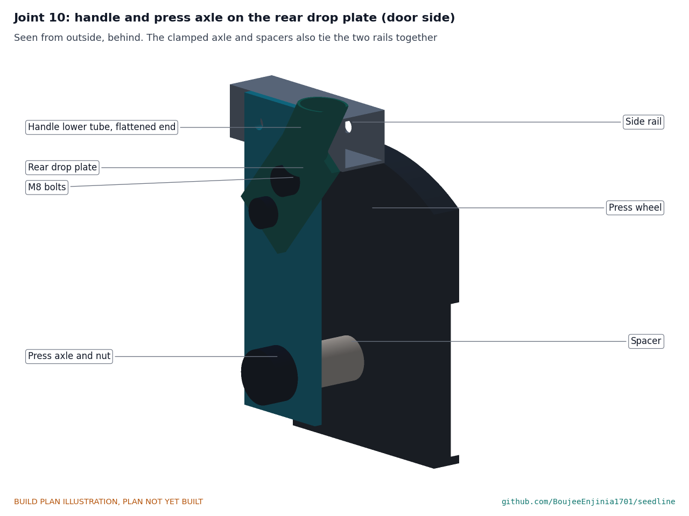

*Figure 26. The handle's flattened end bolts flat to the outside of the plate; the press axle and its spacers are clamped between the two plates.*

Each plate bolts to the outside face of a rail, top edge flush with the rail top, centred 660 mm behind the rail's front end. Clamped tight, the press axle, its two spacers and the wheel's inner spacer tie the two rails together at the back, in place of a cross member.

**Check before moving on.** The axle holes line up across both plates.

### 3.18 Chain guard

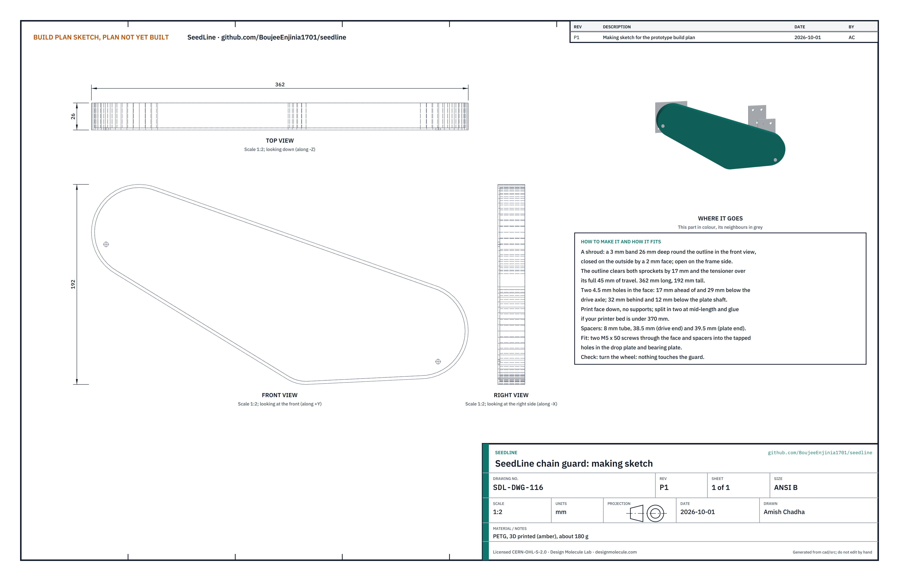

*Figure 27. Chain guard making sketch (SDL-DWG-116).*

**What it is and what it is made from.** A printed shroud over the chain, both sprockets and the tensioner. PETG, about 180 g, in a bright colour.

**How to make it.**

1. Print it face down with no supports: a 3 mm band 26 deep round the outline, closed on the outside by a 2 mm face, open on the frame side; 362 long and 192 tall. If your printer bed is under 370 mm, split it at mid-length and glue the halves.
2. Drill out the two 4.5 mm holes in the face: 17 ahead of and 29 below the drive axle, and 32 behind and 12 below the plate shaft.
3. Cut two spacers from 8 mm tube: 38.5 long (drive end) and 39.5 long (plate end).

**How it fits the parts next to it.**

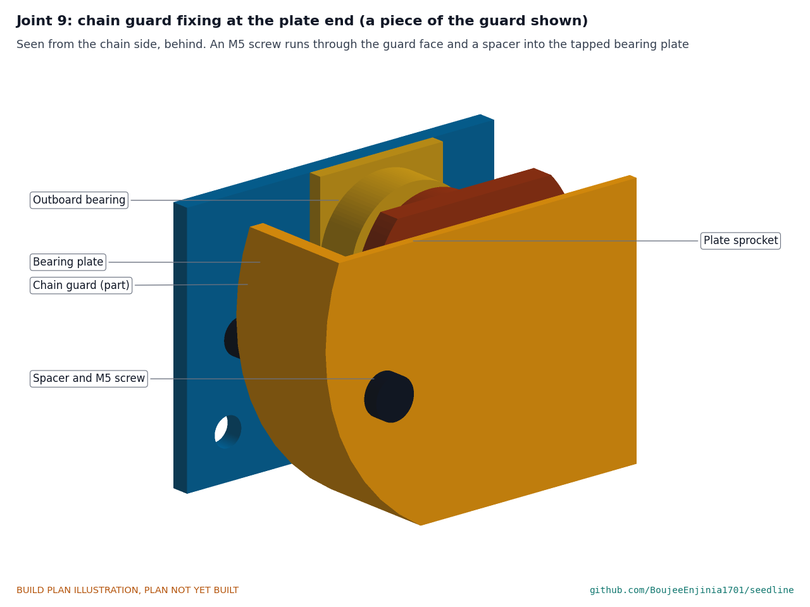

*Figure 28. An M5 x 50 screw passes the guard face and a spacer into the tapped bearing plate; the drive end is the same into the drop plate.*

The guard's outline clears both sprockets by 17 mm and the tensioner over its full 45 mm of travel; the chain runs at least 8.5 mm from it.

**Check before moving on.** With the guard on, turn the wheel ten times: nothing touches the guard.

### 3.19 Handle side tubes and sleeves (make 2 sets)

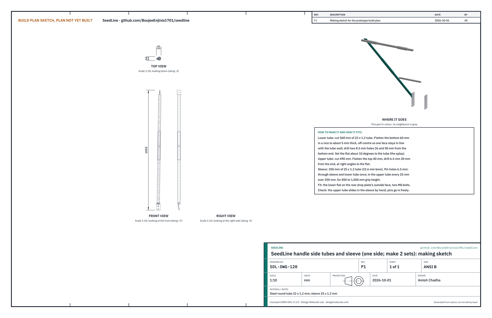

*Figure 29. Handle side tubes and sleeve making sketch (SDL-DWG-120), one side.*

**What they are and what they are made from.** Each side of the handle is a lower tube and an upper tube joined by a sleeve that sets the grip height. Steel round tube 22 x 1.2 mm; sleeve 25 x 1.2 mm.

**How to make them.**

1. Lower tube: cut 560 mm. Flatten the bottom 60 mm in a vice to about 5 mm, keeping one face in line with the tube wall, and set the flat about 10 degrees to the tube (the handle splays outward). Drill two 8.5 mm holes 26 and 50 from the end.
2. Upper tube: cut 490 mm. Flatten the top 40 mm and drill 6.5 mm 20 from the end, square to the flat.
3. Sleeve: cut 250 mm (22.6 mm bore). Drill a 6.5 mm pin hole through the sleeve and lower tube together; drill 6.5 mm pin holes in the upper tube every 25 mm over 250 mm, for grip heights of 850 to 1,050 mm.

**How they fit the parts next to them.** The lower flat bolts to the outside of the rear drop plate with two M8 bolts (Figure 26); the upper tube slides in the sleeve and is held by a pin; the upper flat bolts to the cross grip (Figure 32).

**Check before moving on.** The upper tube slides in the sleeve by hand and the pins go in freely.

### 3.20 Handle brace

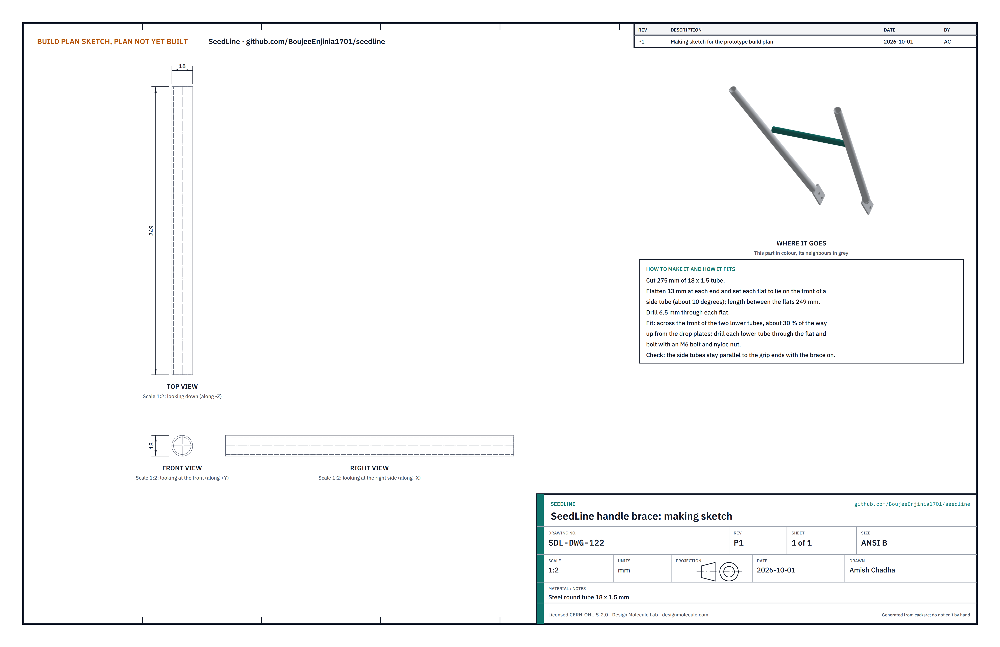

*Figure 30. Handle brace making sketch (SDL-DWG-122).*

**What it is and what it is made from.** A tube across the two lower tubes that keeps them parallel. Steel round tube 18 x 1.5 mm.

**How to make it.**

1. Cut 275 mm and flatten 13 mm at each end, setting each flat to lie on the front of a lower tube; 249 between the flats.
2. Drill 6.5 mm through each flat.

**How it fits the parts next to it.** Across the front of the two lower tubes, about 30 % of the way up from the drop plates. Drill each lower tube through the flat and fit an M6 bolt with a nyloc nut.

**Check before moving on.** With the brace on, the tube tops are 504 mm apart, the same as the grip holes.

### 3.21 Cross grip

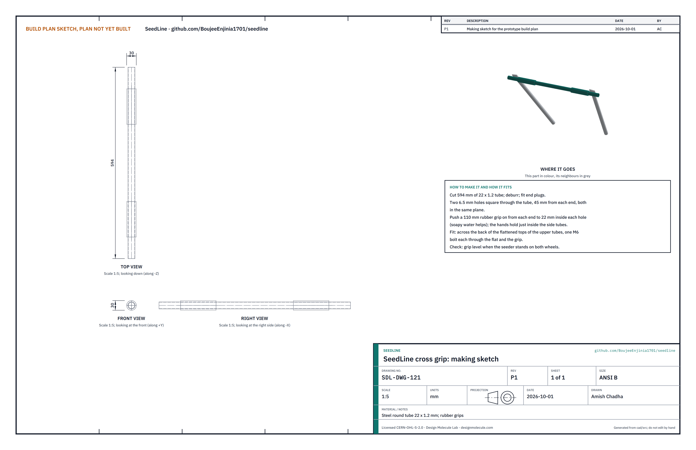

*Figure 31. Cross grip making sketch (SDL-DWG-121).*

**What it is and what it is made from.** The bar the operator pushes. Steel round tube 22 x 1.2 mm, 594 long, with two rubber grips and end plugs.

**How to make it.**

1. Cut 594 mm, deburr and fit end plugs.
2. Drill two 6.5 mm holes square through the tube, 45 from each end, in the same plane.
3. Push a 110 mm rubber grip on from each end to 22 mm inside each hole (soapy water helps), so the hands sit just inside the side tubes.

**How it fits the parts next to it.**

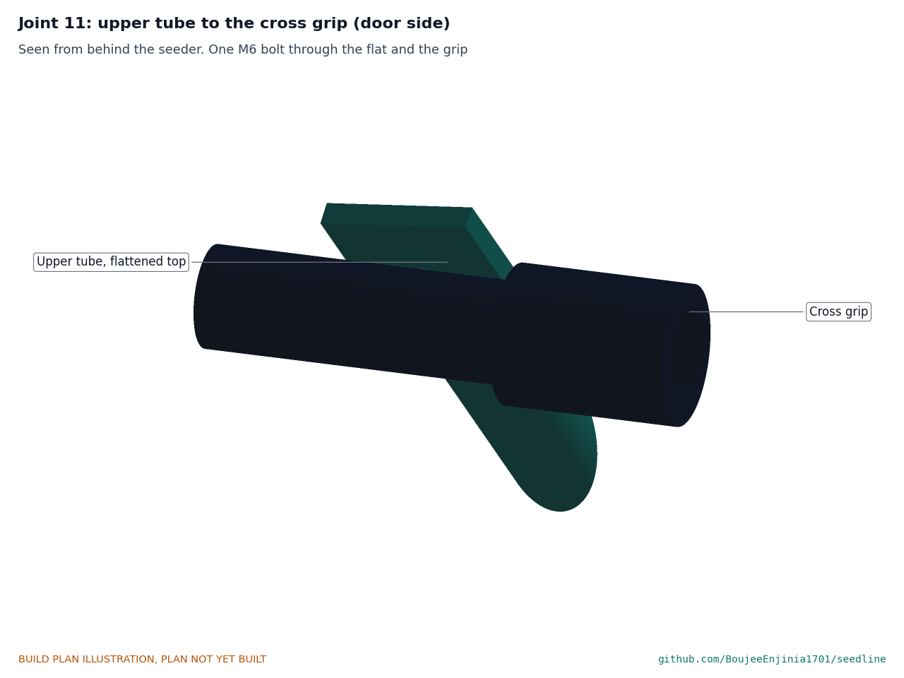

*Figure 32. The grip lies across the back of the upper tube's flattened top; one M6 bolt through both.*

**Check before moving on.** The grip is level with the seeder standing on both wheels.

### 3.22 Row marker mount (row-spacing kit)

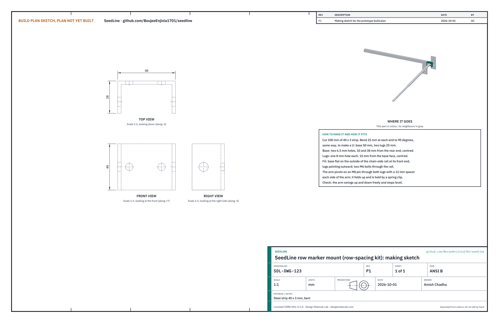

*Figure 33. Row marker mount making sketch (SDL-DWG-123).*

**What it is and what it is made from.** A U-bracket at the front of the chain-side rail that the marker arm pivots on. Steel strip 40 x 3 mm, 100 long.

**How to make it.**

1. Bend 25 mm at each end to 90 degrees, the same way, to make a U with a 50 mm base.
2. Base: two 6.5 mm holes 10 and 38 from the rear end, centred. Lugs: an 8 mm hole in each, 15 from the base face, centred.

**How it fits the parts next to it.**

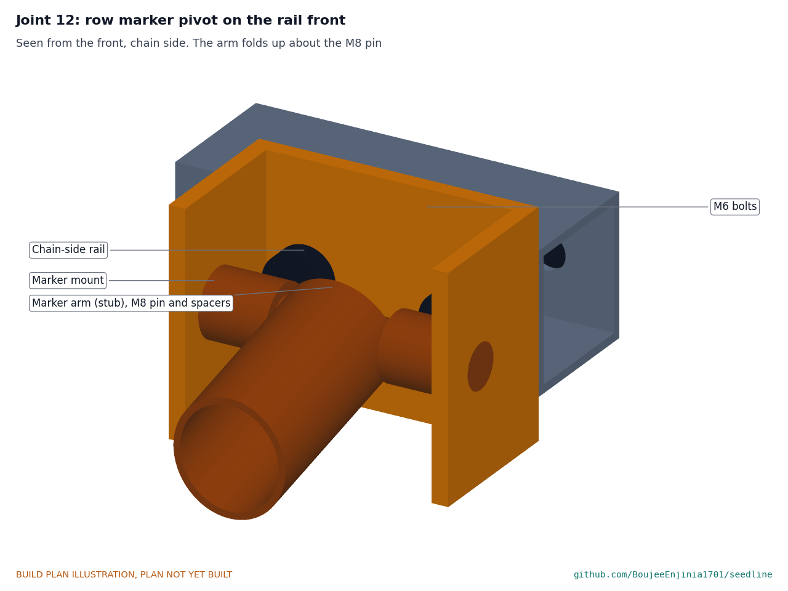

*Figure 34. The base bolts flat to the outside of the chain-side rail at its front end with two M6 bolts; the arm pivots on an M8 pin through both lugs.*

**Check before moving on.** With the arm fitted, it swings up and down freely and stops level.

### 3.23 Row marker arm and disc (row-spacing kit)

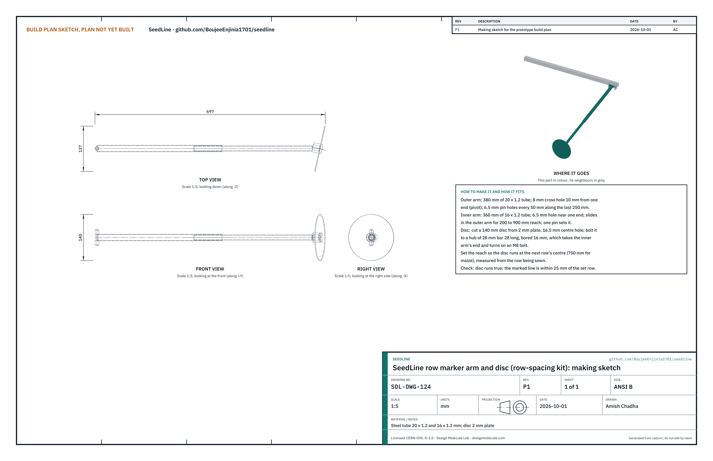

*Figure 35. Row marker arm and disc making sketch (SDL-DWG-124).*

**What it is and what it is made from.** A telescoping arm with a small disc that scratches the line of the next row. Steel tube 20 x 1.2 and 16 x 1.2 mm; disc of 2 mm plate on a hub of 28 mm bar.

**How to make it.**

1. Outer arm: cut 380 mm of 20 mm tube; an 8 mm cross hole 10 from one end for the pivot, and 6.5 mm pin holes every 50 mm along the last 250 mm.
2. Inner arm: cut 360 mm of 16 mm tube with a 6.5 mm hole near one end; it slides in the outer arm.
3. Disc: cut a 140 mm disc with a 16.5 mm centre hole; bolt it to a hub of 28 mm bar, 28 long, bored 16 mm, that takes the inner arm's end and turns on an M8 bolt.
4. Fit two 12 mm spacers on the pivot pin, one each side of the arm.

**How it fits the parts next to it.** The arm pivots on the mount (Figure 34) and folds up for transport, held by a spring clip. Set the reach so the disc runs on the centre of the next row: 750 mm for maize, measured from the row being sown.

**Check before moving on.** The disc runs true, and its line is within 25 mm of the set row spacing over 10 m.

### 3.24 Bought components

Buy to specification, not brand. Line numbers are those of the bill of materials.

- **Drive wheel (line 1).** Steel disc wheel 280 mm across the rim, flat rim 45 mm wide, plain 16 mm hub that can be cross-drilled, no bearings.
- **Drive axle bearings (line 1).** Two pressed-steel two-bolt flange bearings for a 16 mm (5/8 in) shaft, with set-screw inserts.
- **Sprockets and chain (line 2).** Two 15 T #35 sprockets with hubs and set screws, bored 16 mm and 12 mm; #35 roller chain, 76 links with two connecting links.
- **Chain tensioner (line 2).** Spring-loaded #35 chain tensioner of the go-kart kind, with a 10 T idler, about 45 mm of take-up, mounting on one M8 bolt.

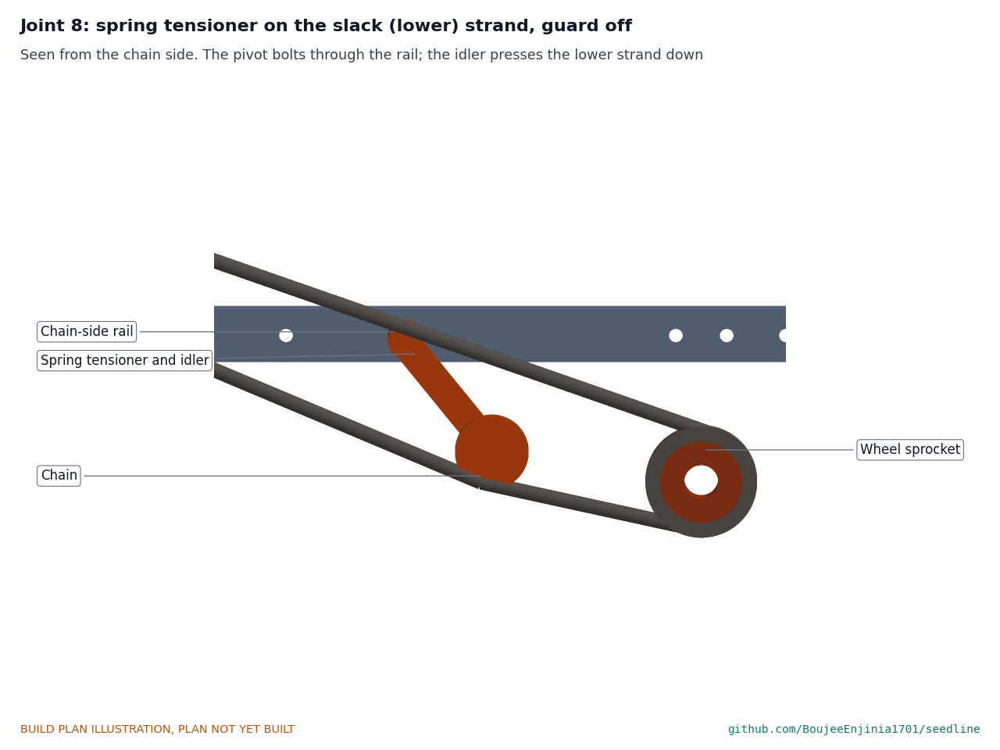

*Figure 36. The tensioner pivots on an M8 bolt through the chain-side rail, between the two strands, with its idler pressing the lower (slack) strand down. Guard off for clarity.*

- **Plate shaft bearings and collar (line 5).** Two pressed-steel two-bolt flange bearings for 12 mm, and one 12 mm shaft collar with a set screw.
- **Singulator brush (line 7).** Nylon strip brush about 12 wide and 35 long, on a printed holder screwed to the outside of the housing's rear wall with two M4 screws in slotted holes, so the gap to the plate rim can be set.
- **Seed drop tube (line 8).** PVC or PE tube 20 mm outside, 16 mm bore, 95 long.
- **Covering chains (line 10).** Two 250 mm lengths of 3 to 4 mm light chain.
- **Press wheel (line 11).** 200 mm concave rubber tread 70 wide, on two bearings with an inner spacer tube, 16 mm bore; a 16 mm axle bolt about 170 long with nuts and washers; two spacers of 21 x 2.5 mm tube, 37.5 long.
- **Fixings (line 15).** About 50 M6 and M8 bolts with nuts and washers (nyloc where a bolt is a pivot or takes vibration), 36 M5 countersunk screws with nuts for the lugs, M4 and M5 screws, two M4 thumb screws, eight M5 and two M4 heat-set inserts, pins and spring clips, threadlocker, grease, paint.

## 4. Putting it together

In each picture the parts already fitted are grey and the parts being fitted are in colour, with an arrow showing the way they go in.

### Step 1: frame

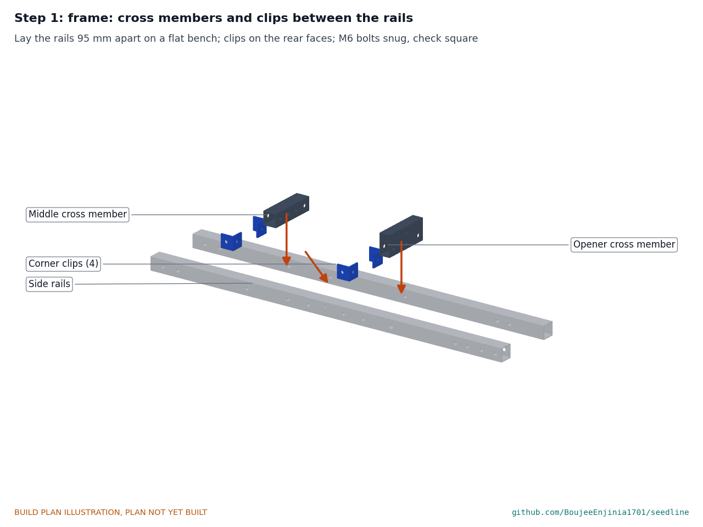

Lay the rails on a flat bench, 95 mm apart inside. Fit both cross members between them with the four clips on their rear faces; bolts snug. Measure both diagonals of the frame: they must match within 2 mm. Then tighten.

### Step 2: front drop plates

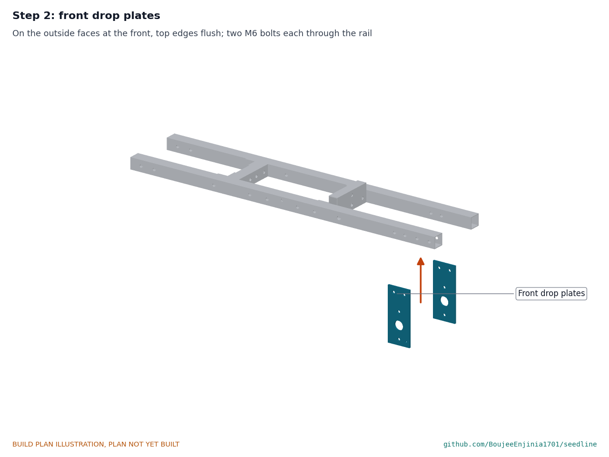

On the outside faces at the front, top edges flush with the rails, two M6 bolts each through the rail.

### Step 3: lugs onto the drive wheel

As section 3.5: every 20 degrees, all upstands trailing, two M5 countersunk screws each with threadlocker.

### Step 4: drive wheel into the frame

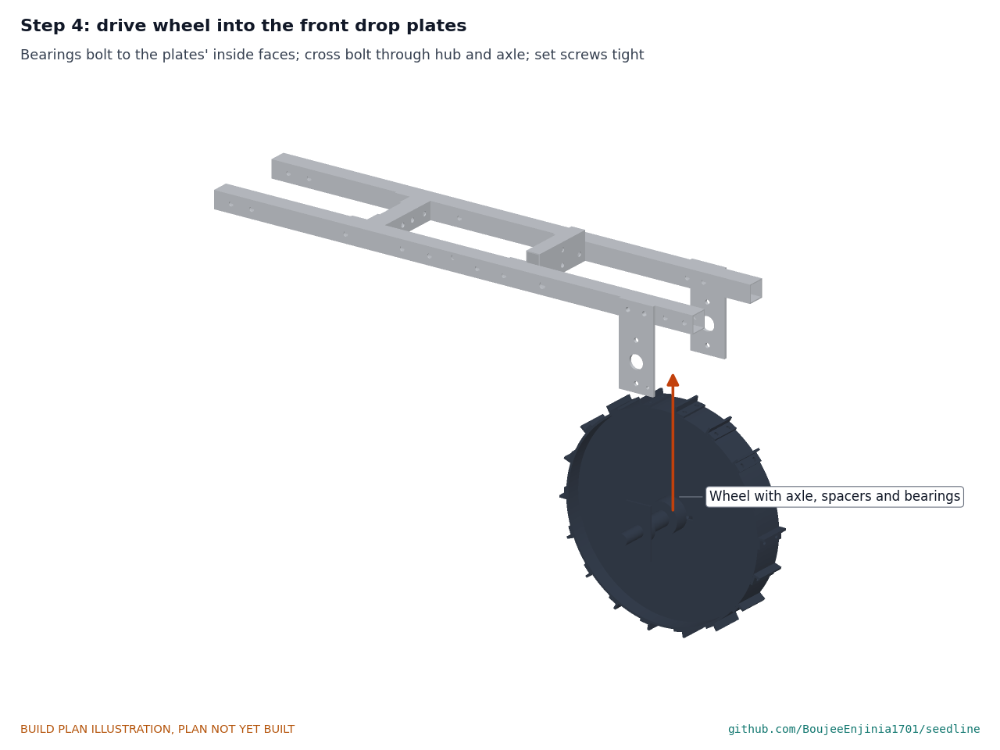

Slide a spacer, the wheel and the other spacer onto the axle, fit the cross bolt through hub and axle with a nyloc nut, and slide on the two flange bearings. Lift the wheel into place and bolt the bearings to the inside faces of the drop plates. Tighten the bearing set screws on their flats. **Hold point:** the wheel turns freely and runs centred between the rails.

### Step 5: metering housing and bearing plate

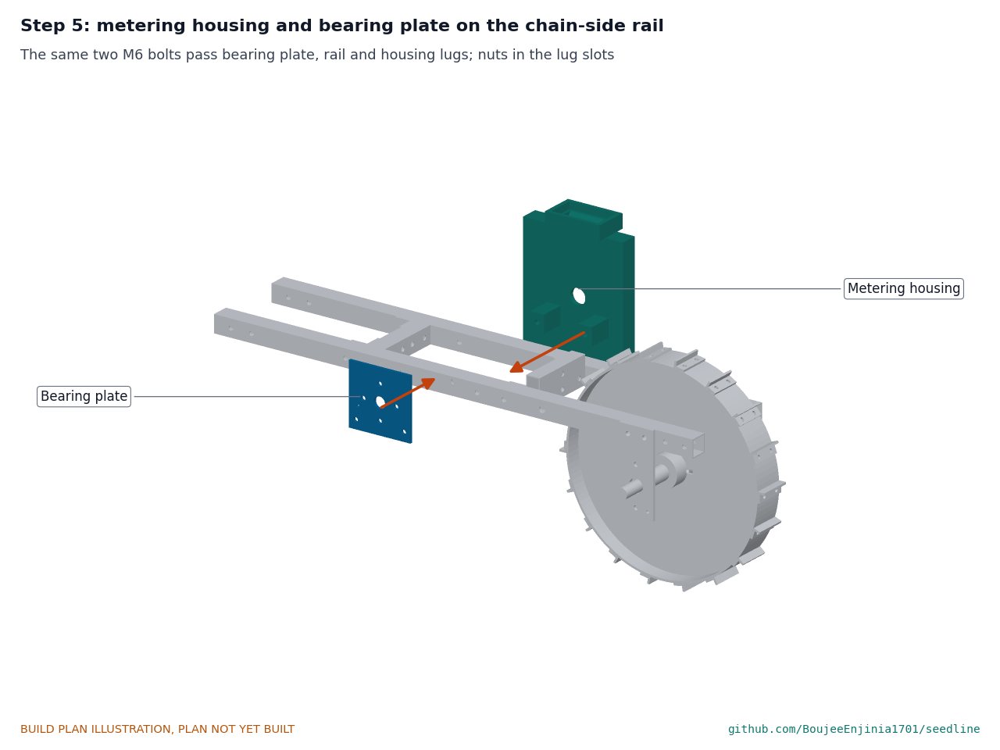

Drop an M6 nut into each housing lug slot. Hold the housing between the rails with its lugs on the inside of the chain-side rail, the bearing plate on the outside, and fit the two M6 bolts through plate, rail and lugs.

### Step 6: plate shaft bearings

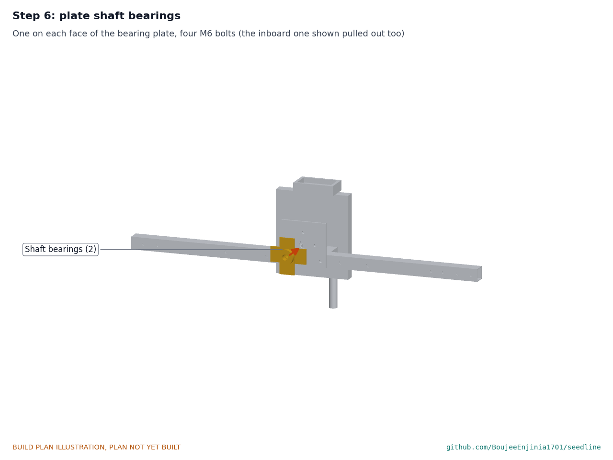

One bearing on each face of the bearing plate: the outboard one with its bolts above and below the shaft, the inboard one with its bolts either side. Four M6 bolts.

### Step 7: plate shaft and collar

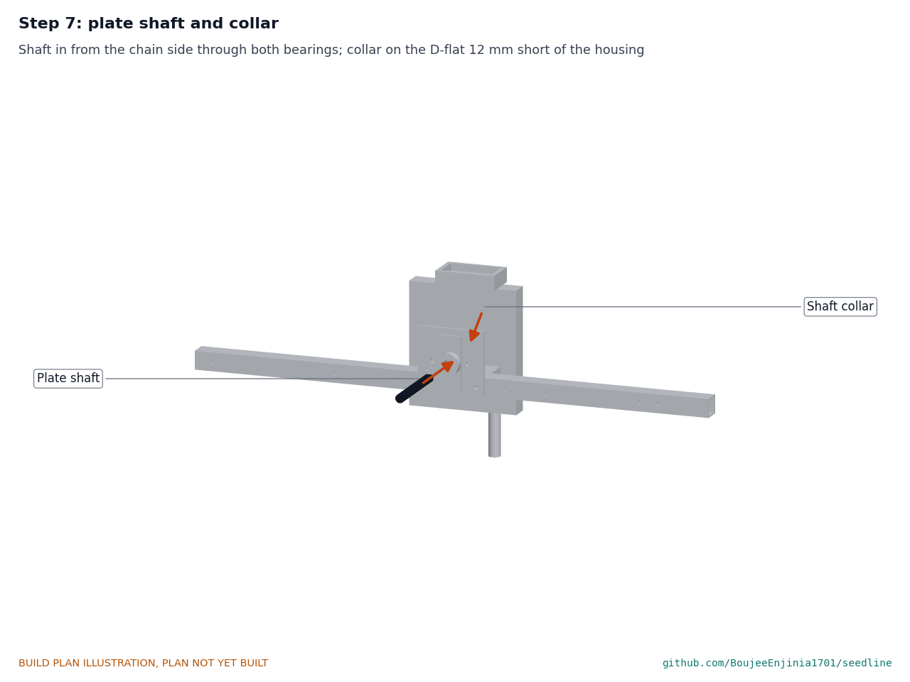

Slide the shaft in from the chain side through both bearings and the housing's hub hole, with the collar threaded on inside the frame before the shaft reaches the housing. Set the collar on the D-flat 12 mm short of the housing wall. Do not tighten the bearing set screws yet.

### Step 8: sprockets

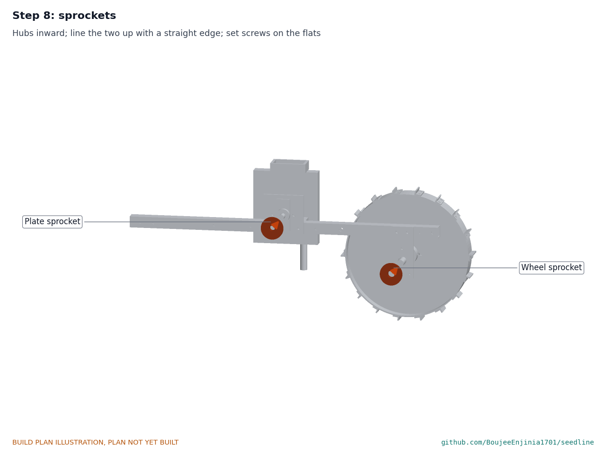

Fit the 16 mm-bore sprocket on the drive axle and the 12 mm-bore one on the plate shaft, hubs inward. Line the two up with a straight edge across their faces, then tighten all set screws on their flats.

### Step 9: tensioner and chain

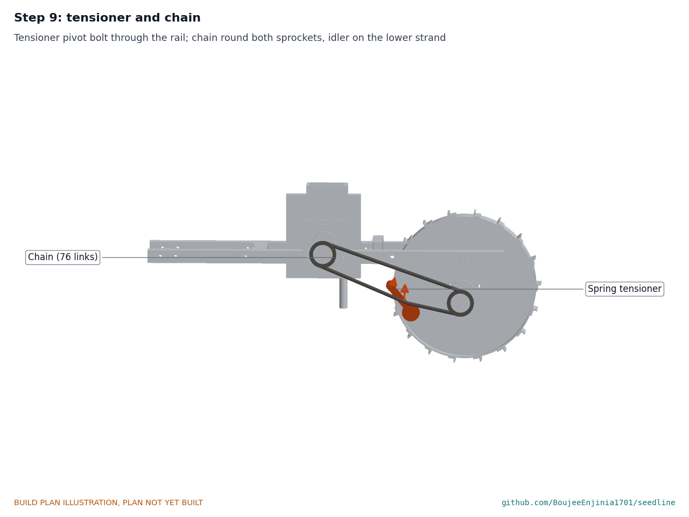

Bolt the tensioner to the chain-side rail on its M8 bolt. Fit the chain round both sprockets with the connecting link's clip facing away from the direction of travel, and let the tensioner's idler bear on the lower strand. **Hold point:** turn the wheel by hand: the chain runs without jumping and the plate shaft turns once per wheel turn.

### Step 10: brush, liners, seed plate, door and knob

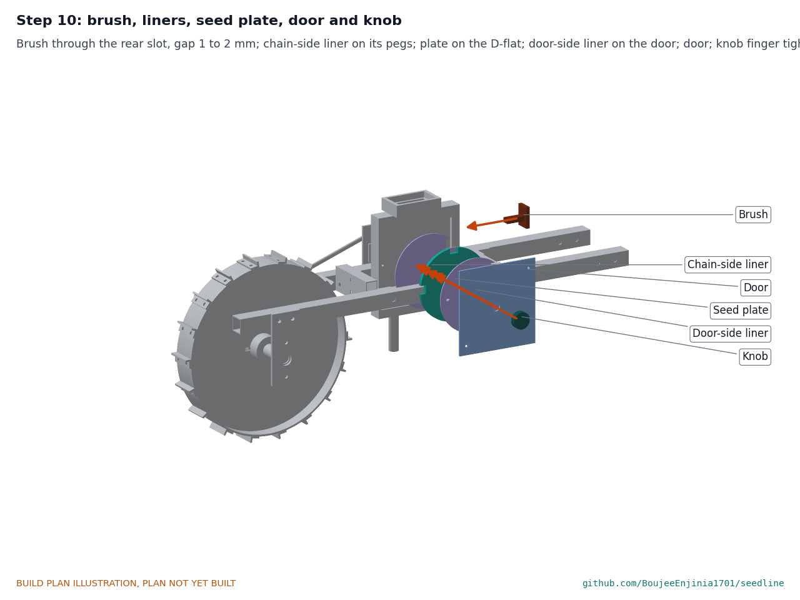

Fit the brush through the rear slot and set its gap to the plate rim at 1 to 2 mm. Press the chain-side liner onto its two pegs against the slot wall, slide the seed plate onto the D-flat until its hub meets the collar, set the door-side liner on the door's pegs, fit the door with its two thumb screws, and screw the knob into the shaft end, finger tight.

### Step 11: hopper uprights and hopper

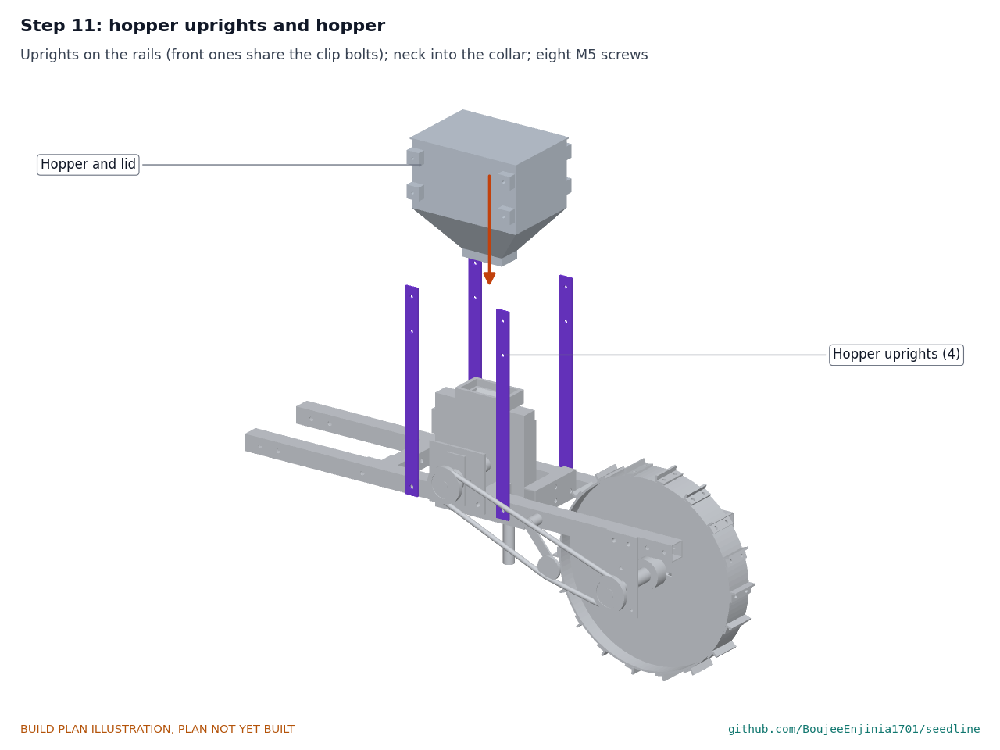

Bolt the four uprights to the outsides of the rails; the front bolts also pass the corner clips. Drop the hopper neck into the collar, line the bosses up with the uprights and fit eight M5 screws. Fit the lid.

### Step 12: opener and seed drop tube

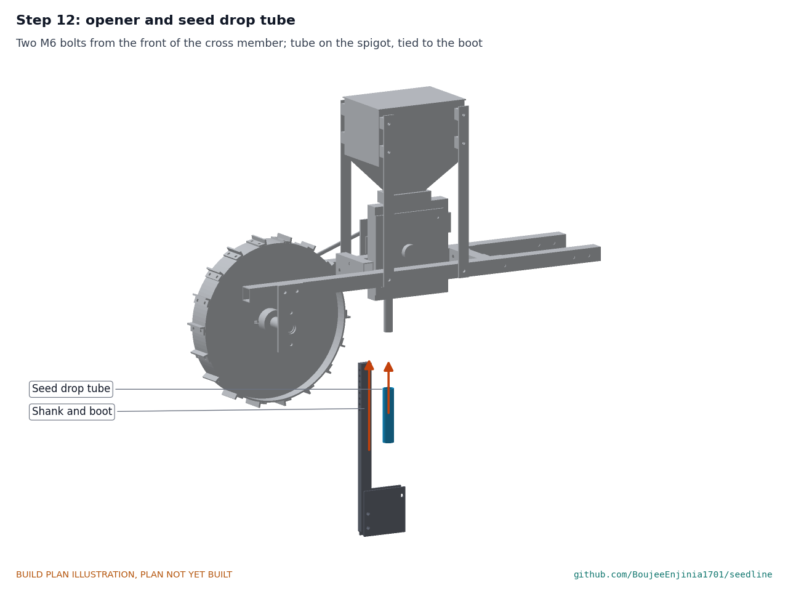

Bolt the boot plates to the shank with the rear spacer. Hold the shank against the back of the opener cross member at the depth you want (the 50 mm setting for maize) and fit two M6 bolts from the front into its tapped holes. Slide the drop tube onto the housing spigot, rest its lower end on the boot plates and tie it on.

### Step 13: covering chains

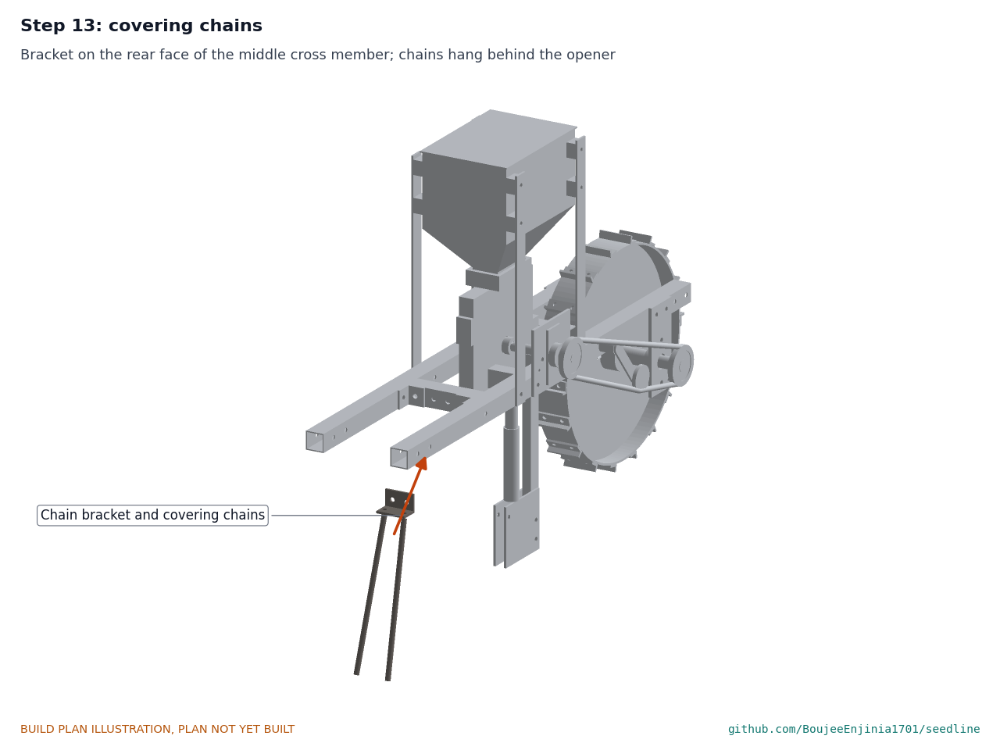

Bolt the bracket to the rear face of the middle cross member and hang the two chains from it.

### Step 14: rear drop plates and press wheel

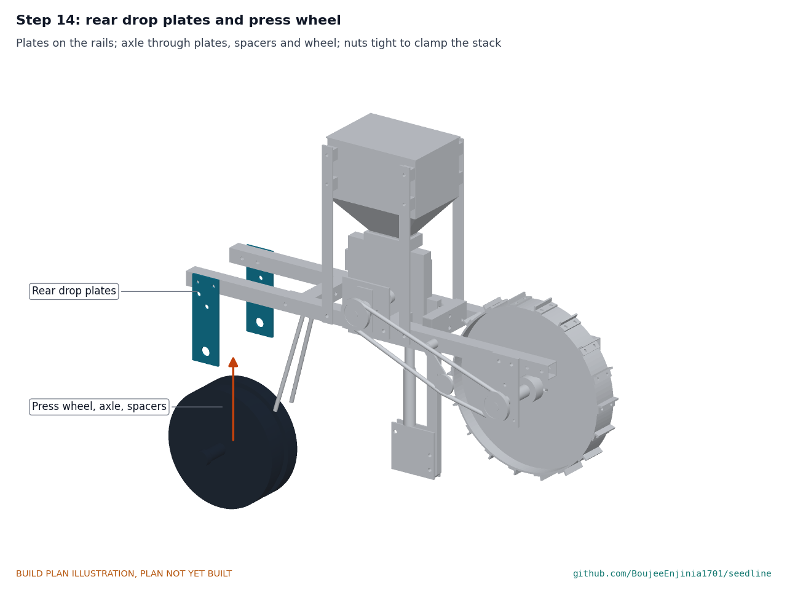

Bolt the rear drop plates to the outsides of the rails. Pass the axle bolt through one plate, a spacer, the wheel, the other spacer and the other plate, and tighten the nuts so the whole stack is clamped. **Hold point:** the press wheel turns freely and the frame does not twist when you lift one rear corner.

### Step 15: chain guard


Hold the guard over the chain with the spacers behind its face and fit the two M5 x 50 screws into the tapped holes. **Hold point:** safety stop S2 in section 6.

### Step 16: handle


Bolt each lower tube's flat to the outside of a rear drop plate with two M8 bolts. Fit the brace. Fit the sleeves and the upper tubes, pin them at the operator's grip height, and bolt the cross grip to the upper tubes' flats.

### Step 17: row marker kit (option)


Bolt the mount to the front of the chain-side rail, fit the arm on its pin with a spacer each side, and set the reach for the row spacing.

## 5. First checks

These are the checks a TRL 4 test report would record; this plan only lists them. Requirement numbers are those of SDL-REQ-001.

*Table 2. First checks.*

| Check | Requirement | How | Pass when |
| --- | --- | --- | --- |
| Travel per wheel turn | R3, R4 | Chalk a lug, roll the seeder 10 turns on a hard floor, measure | 9.42 m, within 1 %, on a hard floor |
| Cells per wheel turn | R3 | Lift the drive wheel, turn it one turn by hand, count cells passing the outlet | 4 cells with the maize plate (ratio 1.0) |
| Chain and guard | R14 | Turn the wheel 20 turns with the guard on; look and listen | No rubbing, no jumping; no nip point reachable with a finger from outside |
| Plate change | R7 | Time a change from maize to another plate, no tools | 2 minutes or less |
| Depth settings | R8 | Seeder on a flat floor; measure the shank bottom below the wheel contact line at each of the six settings | 10 to 60 mm in 10 mm steps, within 2 mm |
| Seed path | R1, R2 | Maize in the hopper, drive wheel lifted, turn it 25 turns by hand over a tray | Seed falls only from the boot; record singles, misses and doubles (100 cells) |
| Hopper | R12 | Fill with water to the rim, measure | 2 L or more, no leaks |
| Mass | R11 | Weigh the seeder with and without the marker kit | 15 kg or less with the kit (14.9 kg estimated) |
| Grip height | R11 | Set the sleeve pin at each hole | 850 to 1,050 mm |
| Marker | R13 | Set 750 mm; roll 10 m beside a string line | Line within 25 mm of 750 mm |
| Push | R10 | Spring scale on the grip, along the handle, on a tilled bed | Record the force; 150 N or less in the design case |

## 6. Safety stops

Stop at each point. Carry on only when everything listed is true.

- **S1. Before any cutting, drilling or grinding.** Safety glasses on; work clamped, never held by hand under a drill; no gloves near a turning drill or grinder; cutting fluid for steel.
- **S2. Before the wheel is turned with the chain fitted (step 9 onward, and every time after).** The chain guard is fitted with both screws, or the wheel is turned only by a second person while the first keeps hands clear of the sprockets. Loose clothing and long hair tied back.
- **S3. Before any plate change, brush adjustment or cleaning.** The drive wheel is lifted clear of the ground and held still (a block under the frame); the hopper is empty or its lid on.
- **S4. Before the seeder leaves the workshop.** Every bolt tight, pivots on nyloc nuts, all cut edges and lug corners deburred, a cover over the opener nose for carrying, the marker arm folded and clipped.
- **S5. Before treated seed is used.** Gloves on; no eating, drinking or smoking while filling; the hopper and housing emptied and cleaned outdoors after use; treated seed kept away from children and animals; the hopper never used for food or feed.
- **S6. Before lifting or turning at a row end.** Grip height set for the operator; two people to lift the seeder into a vehicle or over rough ground; the marker arm folded near people.

## 7. Tools, skills and workspace

**Tools.** Hacksaw with a 24 teeth per inch blade (or a bandsaw); bench vice with soft jaws, big enough to flatten 22 mm tube; bench drill or a drill in a stand; drills 3 to 16.5 mm and a step drill; countersink; M5 and M6 taps with tap wrench and tap drills; flat and half-round files; deburring tool; scriber, engineer's square, steel rule, tape and calipers; hammer; angle grinder with a flap disc for the shank nose; spanners and hex keys for M4 to M8 and the set screws; screwdriver set; soldering iron for heat-set inserts; 3D printer that prints PETG with a bed of at least 180 x 180 mm (370 mm for the guard in one piece); fine-tooth saw or scoring knife for polycarbonate; spring scale to 300 N; kitchen scale to 20 kg; stopwatch.

**Skills.** No certified trade is needed: basic metalwork (marking out, sawing, drilling, tapping, filing, bending strip and flattening tube in a vice), 3D printing, and careful bolting. No welding and no electrics.

**Workspace.** A bench about 1.5 x 0.7 m and floor space about 1.5 x 1.2 m for the assembled seeder; a metalwork corner kept apart from the printer so chips stay off the prints; a ventilated place for the printer; a flat floor for the first checks.

**Personal protective equipment.** Safety glasses for cutting, drilling, grinding and tapping; gloves for handling cut steel and for treated seed; hearing protection when grinding; no gloves near a turning drill.

## 8. Where the numbers come from

- Model and constructability checks: `cad/src/model.py` (`python cad/src/model.py --check`, 78 checks); STEP and STL exports in `cad/step/` and `cad/stl/`.
- Pictures: `cad/src/build_plan_media.py`, using `.kit/build_views.py`; written to `docs/05-build-plan/` and `cad/drawings/SDL-DWG-101` to `SDL-DWG-124`.
- General arrangement: `cad/drawings/SDL-DWG-001.pdf`, Rev P4.
- Calculations: `docs/04-calcs/01-sizing.md` (SDL-CAL-001 v0.3) and `docs/04-calcs/sizing.py`; mass section 5, push force section 6, depth section 9.
- Bill of materials: `bom/bom.csv`.
- Decisions: `docs/decisions/0003-design-for-construction.md` (SDL-DDR-003), with SDL-DDR-001 and SDL-DDR-002.
- Requirements: `docs/03-requirements.md` (SDL-REQ-001 v0.5).
